# ADR-001: MarkSpec — Documentation Format

Status: Accepted\
Date: 2026-03-01\
Scope: MarkSpec

## Context

Fast Track requires a documentation and specification format that is simple,
portable, Git-native, and readable without tooling. The format must support
compliance documentation, requirement authoring, and traceability — while
staying true to the "simplicity as a discipline" principle. This ADR defines
**MarkSpec** — a Markdown flavor for traceable industrial documentation.

Several formats were evaluated: Markdown, AsciiDoc, and Typst. AsciiDoc offers
richer semantics (includes, cross-references, conditionals, attribute
substitution) but introduces authoring complexity and a smaller ecosystem. Typst
is a powerful typesetting system with Markdown-adjacent syntax, but its primary
role is PDF rendering, not authoring. Markdown is universally known, rendered by
every platform, and has the lowest barrier to entry.

The key insight is that the richness belongs in the tooling layer, not in the
document format. Markdown stays pure. The build pipeline adds what's needed.
MarkSpec is the convention that sits on top — CommonMark as the base, GFM/GLFM
as the platform layer, MarkSpec as the specification layer.

---

## Part 1 — Markdown Format

### Authoring format

The documentation format is **CommonMark** extended with the shared subset of
GFM (GitHub Flavored Markdown) and GLFM (GitLab Flavored Markdown). Only
extensions supported by both platforms are used. This ensures portability across
GitHub and GitLab with no degradation.

Platform-specific extensions (GitLab TOC, GitLab includes, GitLab placeholders,
GitHub-only features) are not used. These capabilities are handled by tooling
instead.

### CommonMark baseline

All standard CommonMark features are supported:

- Headings
- Bold / italic
- Links / images
- Blockquotes
- Ordered / unordered lists
- Fenced code blocks
- Inline code
- Horizontal rules
- Inline HTML (`<details>`, `<summary>`, `<kbd>`, etc.)

### GFM / GLFM shared extensions

The following extensions beyond CommonMark are supported on both GitHub and
GitLab:

1. Tables (pipe syntax)
2. Strikethrough (`~~text~~`)
3. Task lists (`- [ ]` / `- [x]`)
4. Footnotes (`[^label]`)
5. Autolinks
6. Syntax highlighting (`` ```rust ``)
7. Math (`$inline$` and `$$block$$`)
8. Alerts (`> [!NOTE]`, `> [!TIP]`, `> [!IMPORTANT]`, `> [!WARNING]`,
   `> [!CAUTION]`)

### Admonitions

Standard alerts are used without custom titles to maintain cross-platform
compatibility. The five supported types are NOTE, TIP, IMPORTANT, WARNING, and
CAUTION.

When a custom title is needed, bold text inside a standard alert is the portable
pattern:

```markdown
> [!WARNING]
> **Data deletion** — The following instructions will make your data
> unrecoverable.
```

Additional semantic admonition types (e.g., SAFETY, RATIONALE, REVIEW) may be
defined by tooling and rendered as styled blocks in PDF output. These use the
same `> [!TYPE]` syntax and degrade to plain blockquotes on platforms that don't
recognize them.

### Variable substitution

**Mustache** (`{{variable}}`) is the templating syntax for variable and ID
substitution in Markdown documents. Mustache is logic-less by design — no
conditionals, no control flow, just key-value lookup. If logic is needed, it
belongs in the build step, not the template.

Variables are resolved from the project's tooling or from document front matter.
Examples: `project.name`, `project.version`, `project.asil`, `project.repo`,
`project.home`, `project.modules`, `module.name`, `module.owner`.

```markdown
# {{module.name}}

Project: {{project.name}} | ASIL: {{project.asil}} | Version:
{{project.version}}
```

### Footnotes

Footnotes are reserved for supplementary context — external standard references,
design rationale, or clarifications. They are not used for traceability.

```markdown
The fault handler shall complete within the watchdog window.[^1]

[^1]: See ISO 26262 Part 6, Section 9.4 for guidance on fault handling timing.
```

### Line breaks

When consecutive lines need to render as separate lines (e.g., attribute
blocks), trailing backslash (`\`) or blank lines are used for line separation.
Both are valid CommonMark. Teams choose their convention.

Trailing backslash is recommended when compactness matters — it keeps lines
grouped as a visual block. Blank lines between lines are acceptable for shorter
or less dense content.

Trailing double-space (``) is not recommended — it is invisible in source,
stripped by most editors, and does not survive formatting or linting.

### Document metadata and review

Git history is the metadata. A merged PR/MR captures authorship, review,
approval, timestamp, and diff. No `status: approved` frontmatter that can drift
from reality. The merge commit is the approval record.

---

## Part 2 — Requirement Authoring

### Requirement types

Three primary types of requirements are defined:

- **STK** — Stakeholder requirements
- **SYS** — System requirements
- **SWE** — Software requirements

### Requirement identifiers

Each requirement has two identifiers:

- **Display ID** — human-readable, formatted as `TYPE_XYZ_NNNN` where `TYPE` is
  STK, SYS, or SWE, `XYZ` is a project or domain abbreviation, and `NNNN` is an
  increasing number starting at 1, unique within the project. Examples:
  `STK_BRK_0001`, `SYS_BRK_0042`, `SWE_BRK_0107`.
- **ULID** — universally unique, formatted as `TYPE_ULID` where `TYPE` is STK,
  SYS, or SWE. Examples: `STK_01HGW2NBX6E3`, `SWE_01HGW2P4KFR7`. The ULID
  ensures global uniqueness across projects and survives renumbering.

The `Id` attribute (ULID) is mandatory for every requirement. It is assigned by
a tooling pass and committed to the repository. Once assigned, it never changes.

### Requirement attributes

Attributes follow the git trailers convention (`Key: Value`) at the end of a
requirement block. They are split into two categories:

**Authored attributes** — written by the author, committed to the repository:

| Attribute        | Description                                                      |
| ---------------- | ---------------------------------------------------------------- |
| **Id**           | ULID, mandatory, assigned by tooling pass                        |
| **Satisfies**    | Upstream link to parent requirement(s)                           |
| **Derived-from** | Upstream link to external source (standard, regulation, HARA)    |
| **Labels**       | Classification tags (ASIL-B, CAL-3, security, performance, etc.) |

**Generated attributes** — computed by tooling from the repository, never
committed:

| Attribute          | Description                                                        |
| ------------------ | ------------------------------------------------------------------ |
| **Verified-by**    | Downstream link to test(s) that verify this requirement            |
| **Implemented-by** | Downstream link to code/component that implements this requirement |

The upstream direction is natural at authoring time — the author knows what the
requirement satisfies or is derived from. Downstream links are discovered later
when tests and code are added. Tests and code declare their own upstream links:

```rust
/// Verifies: SWE_BRK_0107
#[test]
fn test_debounce_filters_noise() { ... }
```

```rust
/// Implements: SWE_BRK_0107
fn debounce_input(raw: u16) -> u16 { ... }
```

Tooling walks the repository, collects all upstream declarations, and generates
the bidirectional traceability matrix. The authored requirement is never
modified by tooling after the ULID is assigned. Git history stays clean — author
intent is always distinguishable from generated output.

### Requirement format

Requirements are declared directly in Markdown as list items:

```markdown
- [DISPLAY_ID] Requirement title

  Body paragraphs describing the requirement.

  Key: Value\
  Key: Value
```

The structure is:

- A list item starting with `- [DISPLAY_ID]` marks a requirement boundary
- The first line after the ID is the title
- Subsequent paragraphs are the body text
- Trailing `Key: Value` lines (git trailers convention) are structured
  attributes

### Example

```markdown
- [STK_BRK_0001] Brake response time

  The braking system shall achieve full braking force within 150ms of driver
  input under all operating conditions.

  Id: STK_01HGW2NBX6E3\
  Labels: ASIL-B

- [SYS_BRK_0042] Sensor noise filtering

  The braking system shall filter sensor noise to prevent spurious brake
  activation.

  Id: SYS_01HGW2P4KFR7\
  Satisfies: STK_BRK_0001\
  Labels: ASIL-B

- [SWE_BRK_0107] Sensor input debouncing

  The sensor driver shall debounce raw inputs to eliminate electrical noise
  before processing.

  The debounce window shall be configurable per sensor type.

  > [!WARNING]
  > Failure to debounce may lead to spurious brake activation.

  Id: SWE_01HGW2Q8MNP3\
  Satisfies: SYS_BRK_0042\
  Labels: ASIL-B
```

### Test types

Three test types mirror the requirement hierarchy, following the V-model:

| Requirement | Test    | Full name                        |
| ----------- | ------- | -------------------------------- |
| **STK**     | **VAL** | Acceptance Test                  |
| **SYS**     | **SIT** | System Integration Test          |
| **SWE**     | **SWT** | Software Unit Qualification Test |

Test identifiers follow the same format as requirements: `TYPE_XYZ_NNNN` for
display IDs, `TYPE_ULID` for universal IDs. Examples: `VAL_BRK_0001`,
`SIT_BRK_0042`, `SWT_BRK_0107`.

Each test level verifies its corresponding requirement level:

- **VAL** tests verify **STK** requirements — acceptance testing against
  stakeholder needs.
- **SIT** tests verify **SYS** requirements — system integration testing.
- **SWT** tests verify **SWE** requirements — software unit qualification
  testing.

Test scenarios can be authored as MarkSpec items in Markdown files, using the
same format as requirements:

````markdown
- [SWT_BRK_0107] Sensor input debounce filtering

  ```gherkin
  Scenario: Noise spike shorter than debounce window
    Given a debounce window of 10ms
    And a stable pressure reading of 500
    When a spike of 999 occurs for 5ms
    Then the output shall remain 500
  ```
````

Id: SWT_01HGW2S3TNQ8\
Verifies: SWE_BRK_0107\
Labels: ASIL-B

````
Test code then declares its upstream link using the same annotation convention:

```rust
/// Verifies: SWE_BRK_0107
#[test]
fn swt_brk_0107_debounce_filters_noise() { ... }
````

### In-code requirements (Specification by Example)

When following ATDD, BDD, or Specification by Example practices, the requirement
and its verification can colocate in the same source file. The doc comment on a
test function _is_ the software requirement. The test function below it _is_ the
verification. No separate Markdown file or test specification is needed — the
specification and its proof live together.

In Markdown files, the `- [DISPLAY_ID]` bullet marks a requirement boundary
within surrounding prose. In doc comments, the comment _is_ the requirement —
the bullet is optional. Tooling recognizes a doc comment as a MarkSpec
requirement when it starts with `[TYPE_XYZ_NNNN]`, with or without a leading
`-`.

**Rust:**

````rust
/// [SWE_BRK_0107] Sensor input debouncing
///
/// The sensor driver shall reject transient noise shorter than
/// the configured debounce window.
///
/// ```gherkin
/// Scenario: Noise spike shorter than debounce window
///   Given a debounce window of 10ms
///   And a stable pressure reading of 500
///   When a spike of 999 occurs for 5ms
///   Then the output shall remain 500
///
/// Scenario: Sustained change longer than debounce window
///   Given a debounce window of 10ms
///   And a stable pressure reading of 500
///   When the reading changes to 600 for 15ms
///   Then the output shall change to 600
/// ```
///
/// Id: SWE_01HGW2R9QLP4 \
/// Satisfies: SYS_BRK_0042 \
/// Labels: ASIL-B
#[test]
fn swt_brk_0107_debounce_filters_noise() {
    // test implementation
}
````

**Kotlin:**

````kotlin
/**
 * [SWE_BRK_0107] Sensor input debouncing
 *
 * The sensor driver shall reject transient noise shorter than
 * the configured debounce window.
 *
 * ```gherkin
 * Scenario: Noise spike shorter than debounce window
 *   Given a debounce window of 10ms
 *   And a stable pressure reading of 500
 *   When a spike of 999 occurs for 5ms
 *   Then the output shall remain 500
 * ```
 *
 * Id: SWE_01HGW2R9QLP4 \
 * Satisfies: SYS_BRK_0042 \
 * Labels: ASIL-B
 */
@Test
fun `swt_brk_0107 debounce filters noise`() {
    // test implementation
}
````

The doc comment is the requirement. The test function is the verification. They
live together — the specification and its proof in the same location. The
`Verified-by` link is implicit: tooling discovers that the test function
carrying this requirement's doc comment is the SWT.

Tooling extracts doc comments to produce the same traceability output as
Markdown-authored requirements. The Gherkin scenarios are concrete, executable
examples that define the expected behavior. They serve simultaneously as
specification, documentation, and test definition.

See Annex B for C, C++, Java (JDK 23+), and legacy Java (Javadoc) examples.

### Traceability matrix

The traceability matrix is a generated Markdown table included in the book as a
chapter. It is never committed — it is a build artifact produced by tooling from
the upstream declarations in requirements, tests, and code.

The matrix has four columns:

| ID             | Requirement                                                                            | Implemented-by            | Verified-by    |
| -------------- | -------------------------------------------------------------------------------------- | ------------------------- | -------------- |
| `STK_BRK_0001` | [Brake response time](../product/stakeholder-requirements.md#stk_brk_0001)             | `SYS_BRK_0042`            | `VAL_BRK_0001` |
| `SYS_BRK_0042` | [Sensor noise filtering](../product/system-requirements.md#sys_brk_0042)               | `SWE_BRK_0107`            | `SIT_BRK_0042` |
| `SWE_BRK_0107` | [Sensor input debouncing](../product/software-requirements/braking.md#swe_brk_0107)    | `braking::debounce_input` | `SWT_BRK_0107` |
| `SWE_BRK_0108` | [Brake pressure calculation](../product/software-requirements/braking.md#swe_brk_0108) |                           |                |

- **ID** — display ID of the requirement.
- **Requirement** — title, linked to the requirement's location in the book. The
  reader clicks through to the full text.
- **Implemented-by** — for STK: the SYS requirement(s) that refine it. For SYS:
  the SWE requirement(s). For SWE: the code symbol(s).
- **Verified-by** — the test(s) at the corresponding level (VAL, SIT, or SWT).

Empty cells are gaps. The table is the single view an auditor uses to assess
coverage completeness. Every row follows the same structure regardless of
requirement level — only the meaning of the downstream links shifts.

---

## Part 3 — Diagram Authoring

### Format and storage

Diagrams are stored as SVG files alongside the documents that reference them.
The naming convention mirrors the document name:

```
modules/braking/
├── specification.md
├── specification-overview.svg
├── specification-state-machine.svg
└── specification-sequence.svg
```

Diagrams are embedded using standard Markdown image syntax with relative paths:

```markdown

```

This renders natively on GitHub and GitLab, requires no build step, and keeps
diagrams versioned alongside their documents.

### SVG sizing for PDF documents (A4, ~25mm margins)

| Type              | Ratio | Width | Height | Use                                   |
| ----------------- | ----- | ----- | ------ | ------------------------------------- |
| Full width        | 16:9  | 700   | 400    | Architecture overviews, flow diagrams |
| Full width tall   | 4:3   | 700   | 525    | Detailed system diagrams              |
| Full width square | 1:1   | 700   | 700    | State machines, class diagrams        |
| Half width        | 4:3   | 340   | 250    | Inline diagrams, small illustrations  |
| Full page         | 3:4   | 700   | 900    | Complex diagrams needing a full page  |

### SVG sizing for presentations (16:9 slides)

| Type         | Ratio | Width | Height | Use                         |
| ------------ | ----- | ----- | ------ | --------------------------- |
| Full slide   | 16:9  | 1600  | 900    | Full bleed diagram          |
| Content area | 16:9  | 1400  | 780    | With title and margins      |
| Half slide   | 9:10  | 700   | 780    | Diagram + text side by side |
| Quarter      | 16:9  | 700   | 390    | Small inline diagram        |

### SVG guidelines

- Always set the `viewBox` attribute to the dimensions above. Omit fixed
  `width`/`height` attributes — let the container control the display size.
- The same SVG works in both PDF and presentation contexts — the container
  decides the size.

### Visual style

- **Monochrome preferred.** Use black, white, and shades of gray. Diagrams
  should be readable when printed in grayscale — color is decorative, not
  structural. If color is used, limit it to one accent color for emphasis (e.g.,
  highlighting a safety-critical path).
- **High contrast.** Black strokes on white background. Avoid light gray lines
  or low-contrast fills that disappear on screen or in print.
- **Consistent stroke weight.** Use 1.5–2px for primary lines, 1px for
  secondary. Avoid hairlines (< 1px) — they vanish in PDF rendering.
- **Readable text size.** Minimum 12px for labels, 14px for titles. Text must
  remain legible when the diagram scales down in a document.
- **Clear hierarchy.** Use stroke weight, fill, and spacing to distinguish
  primary elements from secondary. Avoid relying on color alone to convey
  meaning.
- **Whitespace.** Leave generous padding between elements. Dense diagrams are
  harder to read than simple ones with breathing room.
- **Fonts.** Use sans-serif fonts (Arial, Helvetica, or system sans-serif).
  Embed text as paths if font consistency across platforms is critical.

### Tooling

Diagrams are authored with any tool that produces clean SVG (draw.io,
Excalidraw, Inkscape, or code-based tools like D2 or Graphviz). The tooling
choice is not prescribed — the SVG output is what matters.

### PlantUML

PlantUML is recommended for sequence diagrams and state machine diagrams. These
diagram types benefit from a textual, diffable source that lives in the
repository alongside the code it describes.

PlantUML source files are stored with a `.puml` extension. The generated SVG is
stored alongside with a `.plantuml.svg` suffix, indicating that the PlantUML
source is embedded in the SVG metadata:

```
modules/braking/
├── specification.md
├── specification-sequence.puml
├── specification-sequence.plantuml.svg
├── specification-state-machine.puml
└── specification-state-machine.plantuml.svg
```

The Markdown references the SVG:

```markdown

```

**Viewport control in PlantUML:**

```plantuml
@startuml
' Remove fixed width/height from SVG output — allows scaling
skinparam svgDimensionStyle false

' Scale the diagram (0.5 = half, 1.5 = 150%, etc.)
scale 1.0

' Control density
skinparam ranksep 20
skinparam nodesep 25

' Apply monochrome theme
skinparam monochrome true
skinparam shadowing false

Alice -> Bob : request
Bob --> Alice : response
@enduml
```



Key settings:

- `skinparam svgDimensionStyle false` — removes fixed `width`/`height` from the
  SVG header, enabling proper scaling in containers.
- `scale` — controls the overall diagram scale. Use `scale 1.0` for default,
  adjust for larger or smaller output.
- `skinparam ranksep` / `nodesep` — controls vertical and horizontal spacing
  between elements.
- `skinparam dpi 150` — increases resolution for finer detail when needed.
- `skinparam monochrome true` — applies the monochrome style (see Annex A).

---

## Part 4 — Book Structure (MarkBook)

### Rendering

Project documentation is rendered as a navigable book. The book structure is
defined by a `SUMMARY.md` file at the root of the documentation source
directory.

The current renderer is [mdBook](https://rust-lang.github.io/mdBook/). mdBook is
Rust-native, operates on plain Markdown, produces static HTML, and requires no
runtime. The output is a self-contained site suitable for local browsing,
internal hosting, or auditor delivery.

### SUMMARY.md format

The `SUMMARY.md` file currently follows mdBook's format:

- **Prefix chapters** — unnested links before any numbered content. Not numbered
  in the sidebar.
- **Part titles** — level 1 headings (`# Title`). Rendered as unclickable
  section dividers.
- **Numbered chapters** — list items with links (`- [Title](path.md)`). Nesting
  creates sub-chapters.
- **Suffix chapters** — unnested links after all numbered content.
- **Draft chapters** — list items without a path (`- [Title]()`). Rendered as
  disabled links, signaling planned content.
- **Separators** — a line of `---` between sections.

### Convention

The book source directory follows this layout:

```
src/
├── CHANGELOG.md
├── CONTRIBUTING.md
├── LICENSE.md
├── SUMMARY.md
└── docs/
    ├── GLOSSARY.md
    ├── OVERVIEW.md
    ├── architecture/
    │   ├── decisions/
    │   │   └── adr-001-documentation-format.md
    │   ├── interface-contracts.md
    │   ├── software-architecture.md
    │   └── system-architecture.md
    ├── guide/
    │   ├── configuration.md
    │   ├── getting-started.md
    │   └── troubleshooting.md
    ├── product/
    │   ├── software-requirements/
    │   │   ├── README.md
    │   │   ├── braking.md
    │   │   ├── diagnostics.md
    │   │   └── steering.md
    │   ├── stakeholder-requirements.md
    │   └── system-requirements.md
    └── verification/
        └── traceability-matrix.md
```

The corresponding `SUMMARY.md`:

```markdown
# Summary

[Overview](docs/OVERVIEW.md)

---

# Product

- [Stakeholder Requirements](docs/product/stakeholder-requirements.md)
- [System Requirements](docs/product/system-requirements.md)
- [Software Requirements](docs/product/software-requirements/README.md)
  - [Braking](docs/product/software-requirements/braking.md)
  - [Steering](docs/product/software-requirements/steering.md)
  - [Diagnostics](docs/product/software-requirements/diagnostics.md)

# Architecture

- [System Architecture](docs/architecture/system-architecture.md)
- [Software Architecture](docs/architecture/software-architecture.md)
- [Interface Contracts](docs/architecture/interface-contracts.md)
- [Decisions](docs/architecture/decisions/README.md)
  - [ADR-001: Documentation Format](docs/architecture/decisions/adr-001-documentation-format.md)

# Guide

- [Getting Started](docs/guide/getting-started.md)
- [Configuration](docs/guide/configuration.md)
- [Troubleshooting](docs/guide/troubleshooting.md)

# Verification

- [Traceability Matrix](docs/verification/traceability-matrix.md)

---

[Glossary](docs/GLOSSARY.md) [Contributing](CONTRIBUTING.md)
[Changelog](CHANGELOG.md) [License](LICENSE.md)
```

### Structure rules

- **Front matter** — `OVERVIEW.md` is a prefix chapter. It introduces the
  project and appears at the top of the sidebar without numbering.
- **Back matter** — `GLOSSARY.md`, `CONTRIBUTING.md`, `CHANGELOG.md`, and
  `LICENSE.md` are suffix chapters. They appear at the bottom of the sidebar
  without numbering. Reference material, contribution guidelines, and
  administrative content belong at the end.
- **Four parts:**
  - **Product** — what the system shall do. Stakeholder, system, and software
    requirements. Follows the V-model hierarchy: stakeholder → system →
    software.
  - **Architecture** — how the system is built. System and software
    architecture, interface contracts, and architectural decisions (ADRs).
  - **Guide** — how to use the system. Getting started, configuration,
    operational guidance.
  - **Verification** — evidence that the system meets its requirements. Contains
    generated artifacts such as the traceability matrix.
- **Numbered chapters** within each part are ordered by scope: broad to narrow,
  parent to child.
- **Sub-chapters** are used when a chapter has natural subdivisions (e.g.,
  software requirements split by module). The parent chapter (`README.md`)
  introduces the section; children contain the detail.
- **Draft chapters** signal planned documentation that does not yet exist. They
  are committed to the SUMMARY.md to communicate intent and track completeness.

### Authoring

The `SUMMARY.md` is authored manually. It is a deliberate table of contents, not
a generated file tree. The author decides what appears in the book and in what
order.

Tooling may validate that every file referenced in `SUMMARY.md` exists, and may
warn about Markdown files in the source directory that are not referenced. But
the summary itself is human-authored and committed.

### Glossary

The glossary is a suffix chapter — reference material placed in the back matter
of the book.

It is a Markdown file using heading levels as its organizing structure:

- **Level 1** — Glossary (document title)
- **Level 2** — Letter (alphabetical grouping)
- **Level 3** — Term (one heading per term)

The body under each term heading is the definition. It reads as a natural
document — no special syntax, no structured attributes.

```markdown
# Glossary

## A

### ASIL

Automotive Safety Integrity Level. Risk classification defined by [ISO 26262]
ranging from QM (quality managed, no safety relevance) to D (highest
criticality). The level is determined by the [HARA] process based on severity,
exposure, and controllability.

### ASPICE

Automotive SPICE. A process assessment model for the automotive industry derived
from [ISO/IEC 15504]. Defines capability levels for software development
processes.

## H

### HARA

Hazard Analysis and Risk Assessment. Systematic process defined in [ISO 26262]
Part 3 for identifying hazards, classifying risks, and assigning [ASIL] levels
to safety goals.
```

Terms reference other glossary entries and external standards using Markdown
link references. The same term can be linked from any definition without
duplication:

```markdown
The level is determined by the [HARA] process based on severity, exposure, and
controllability.
```

All link references are placed at the end of the file, grouped into two blocks —
internal cross-links first, then external references:

```markdown
<!-- Internal references (glossary cross-links) -->

[ASIL]: #asil
[ASPICE]: #aspice
[CAL]: #cal
[HARA]: #hara

<!-- External references -->

[ISO 26262]: https://www.iso.org/standard/68383.html
[ISO/SAE 21434]: https://www.iso.org/standard/70918.html
[ISO/IEC 15504]: https://www.iso.org/standard/60555.html
```

End-of-file placement is chosen over end-of-section because glossary entries
cross-reference heavily — the same terms appear across many definitions.
Duplicating link definitions per section is a maintenance liability. A single
block at the end keeps definitions in one place.

Internal references use heading anchors (`#asil`, `#hara`). External references
use full URLs to the authoritative source. Both are standard Markdown link
references, rendered correctly on GitHub and GitLab.

---

## Consequences

- Markdown stays pure GFM/GLFM — no custom syntax, no dialect, no learning
  curve.
- All richness (variables, IDs, traceability, rendering) lives in the tooling
  layer.
- Documents are readable raw and rendered correctly on GitHub and GitLab.
- Requirements are authored in the same Markdown files as design documentation —
  no separate tool, no spreadsheet, no external database.
- Authored attributes capture upstream intent. Downstream traceability is
  generated, never manually maintained.
- Git history stays clean — only human-authored content is committed. Generated
  outputs (traceability matrix, enriched docs) are build artifacts.
- The glossary is a plain Markdown file with heading-based structure — no YAML,
  no database, same format as everything else.
- The documentation renders as a navigable book. mdBook is the current renderer;
  MarkBook is a future replacement.
- The format is portable across GitHub and GitLab with no degradation.
- Requirements interchange with external ALM tools (DOORS, Codebeamer, Polarion)
  is supported via ReqIF export and REST API sync. The MarkSpec ULID is the
  reconciliation key across all systems.
- The approach is consistent with Fast Track principles: simple, basic, modern,
  compatible.

---

## Annex A — Color Palettes

The following palettes are recommended for diagrams and figures. They are
designed for technical and scientific use, are colorblind-safe (accessible to
protanopia, deuteranopia, and tritanopia), and remain distinguishable when
printed in grayscale.

### Monochrome palette (default)

Use this palette by default. It works in every context — screen, print, PDF,
light mode, dark mode.

| Role           | Color       | Hex       | Use                            |
| -------------- | ----------- | --------- | ------------------------------ |
| Primary stroke | Black       | `#000000` | Lines, borders, text           |
| Primary fill   | White       | `#FFFFFF` | Backgrounds, containers        |
| Secondary fill | Light gray  | `#E0E0E0` | Inactive elements, grouping    |
| Tertiary fill  | Medium gray | `#9E9E9E` | De-emphasized elements         |
| Accent fill    | Dark gray   | `#424242` | Highlighted elements, emphasis |

**PlantUML monochrome theme:**

```plantuml
skinparam monochrome true
skinparam shadowing false
skinparam defaultFontName Arial
skinparam defaultFontSize 13
skinparam backgroundColor #FFFFFF
skinparam ArrowColor #000000
skinparam ArrowThickness 1.5
```

### Color palette (when needed)

Based on the Okabe-Ito palette (Wong, Nature Methods 2011). This is the gold
standard for colorblind-safe scientific figures and is recommended by Nature
journals.

Use color sparingly — only when it adds meaning that monochrome cannot convey
(e.g., distinguishing safety-critical paths, status levels, or domain
boundaries). Limit to 3–4 colors per diagram.

| Role             | Color        | Hex       | Use                                     |
| ---------------- | ------------ | --------- | --------------------------------------- |
| Primary          | Blue         | `#0072B2` | Default accent, primary elements        |
| Alert / critical | Vermillion   | `#D55E00` | Warnings, safety-critical paths, errors |
| Success / safe   | Bluish green | `#009E73` | Verified, passing, safe states          |
| Highlight        | Orange       | `#E69F00` | Attention, in-progress, pending         |
| Secondary        | Sky blue     | `#56B4E9` | Secondary elements, backgrounds         |
| Neutral          | Black        | `#000000` | Text, strokes, borders                  |

**PlantUML color theme:**

```plantuml
skinparam shadowing false
skinparam defaultFontName Arial
skinparam defaultFontSize 13
skinparam backgroundColor #FFFFFF
skinparam ArrowColor #000000
skinparam ArrowThickness 1.5

skinparam participant {
  BackgroundColor #56B4E9
  BorderColor #0072B2
  FontColor #000000
}

skinparam note {
  BackgroundColor #E69F00
  BorderColor #D55E00
  FontColor #000000
}

skinparam sequence {
  LifeLineBorderColor #0072B2
  LifeLineBackgroundColor #56B4E9
}
```

### Usage guidelines

- **Default to monochrome.** Only add color when it carries meaning.
- **Never rely on color alone.** Always pair color with another visual cue —
  stroke weight, pattern, label, or shape.
- **Limit to 3–4 colors per diagram.** Beyond that, readers cannot reliably
  distinguish categories.
- **Test in grayscale.** If the diagram is unreadable in grayscale, rethink the
  use of color.
- **Avoid red-green pairings.** The Okabe-Ito palette avoids this by design —
  use vermillion and bluish green instead.

---

## Annex B — In-Code Requirements by Language

The in-code requirement format is the same across all languages that support
Markdown in doc comments. A doc comment starting with `[TYPE_XYZ_NNNN]` (with or
without a leading `-`) is recognized as a MarkSpec requirement. The following
examples show the same requirement in each supported language.

### C (Doxygen)

Doxygen supports Markdown in doc comments since version 1.8 (2011).

```c
/**
 * [SWE_BRK_0107] Sensor input debouncing
 *
 * The sensor driver shall reject transient noise shorter than
 * the configured debounce window.
 *
 * Id: SWE_01HGW2R9QLP4 \
 * Satisfies: SYS_BRK_0042 \
 * Labels: ASIL-B
 */
void debounce_input(uint16_t* raw);
```

### C++ (Doxygen)

```cpp
/// [SWE_BRK_0107] Sensor input debouncing
///
/// The sensor driver shall reject transient noise shorter than
/// the configured debounce window.
///
/// Id: SWE_01HGW2R9QLP4 \
/// Satisfies: SYS_BRK_0042 \
/// Labels: ASIL-B
auto debounce_input(uint16_t raw) -> uint16_t;
```

### Java (JDK 23+)

JDK 23 introduced Markdown documentation comments via `///` (JEP 467). The
format is identical to Rust and C++.

```java
/// [SWE_BRK_0107] Sensor input debouncing
///
/// The sensor driver shall reject transient noise shorter than
/// the configured debounce window.
///
/// Id: SWE_01HGW2R9QLP4 \
/// Satisfies: SYS_BRK_0042 \
/// Labels: ASIL-B
@Test
void swt_brk_0107_debounce_filters_noise() {
    // test implementation
}
```

### Java (legacy Javadoc)

For Java versions prior to JDK 23, Javadoc uses HTML rather than Markdown. The
same format is used — Javadoc renders it as plain text. The `[TYPE_XYZ_NNNN]`
pattern at the start of the comment identifies it as a MarkSpec requirement.
MarkSpec tooling parses it identically to the Markdown variants.

```java
/**
 * [SWE_BRK_0107] Sensor input debouncing
 *
 * The sensor driver shall reject transient noise shorter than
 * the configured debounce window.
 *
 * Id: SWE_01HGW2R9QLP4
 * Satisfies: SYS_BRK_0042
 * Labels: ASIL-B
 */
@Test
void swt_brk_0107_debounce_filters_noise() {
    // test implementation
}
```

Note: trailing backslashes are omitted in legacy Javadoc — they render as
literal characters. Attributes are separated by blank lines or placed on
consecutive lines. Javadoc collapses them visually but MarkSpec tooling reads
them correctly.

### Language support summary

| Language      | Doc syntax       | Markdown native? | MarkSpec renders in doc tool? |
| ------------- | ---------------- | ---------------- | ----------------------------- |
| Rust          | `///`            | ✅               | ✅                            |
| Kotlin        | `/** */` KDoc    | ✅               | ✅                            |
| C++           | `///` Doxygen    | ✅ (since 1.8)   | ✅                            |
| C             | `/** */` Doxygen | ✅ (since 1.8)   | ✅                            |
| Java 23+      | `///`            | ✅ (JEP 467)     | ✅                            |
| Java (legacy) | `/** */` Javadoc | ❌ (HTML)        | Plain text                    |

---

## Annex C — Tool Interoperability

The repository is the source of truth. External ALM tools are downstream
consumers. Requirements are authored in MarkSpec and exported to whatever format
the counterpart needs — not the other way around.

### Reconciliation key

The MarkSpec ULID (`Id` attribute) is the reconciliation key across all external
systems. It travels as a custom attribute in every export format. External tools
assign their own internal identifiers — the ULID survives round-trips regardless
of what each tool does to its own IDs.

### Two integration lanes

**Lane 1 — ReqIF (formal exchange)**

ReqIF (OMG Requirements Interchange Format) is the standard for formal
requirement exchange between organizations — OEMs, suppliers, auditors. Tooling
exports MarkSpec requirements to ReqIF with the following mapping:

| MarkSpec                     | ReqIF                                   |
| ---------------------------- | --------------------------------------- |
| Display ID (`TYPE_XYZ_NNNN`) | String attribute                        |
| Id (ULID)                    | Custom attribute (`markspec.id`)        |
| Requirement body             | XHTML (Markdown → HTML → XHTML)         |
| Satisfies / Derived-from     | SpecRelation                            |
| Labels                       | Enumeration attribute                   |
| —                            | IDENTIFIER (generated GUID, disposable) |

The ReqIF `IDENTIFIER` is generated for ReqIF compliance and is not the
canonical identity. The `markspec.id` custom attribute is the stable key for
reconciliation on re-import.

ReqIF import into the three major ALM platforms:

| Platform           | Vendor                  | ReqIF support | API alternative |
| ------------------ | ----------------------- | ------------- | --------------- |
| DOORS / DOORS Next | Dassault (formerly IBM) | ✅            | OSLC            |
| Codebeamer         | PTC (formerly Intland)  | ✅            | REST v1         |
| Polarion           | Siemens                 | ✅            | REST / SOAP     |

Each platform has its own quirks on import — attribute mapping, ID handling,
XHTML flavor — but these are tooling-layer concerns. The author sees none of
this.

**Lane 2 — REST API (continuous sync)**

For teams that run an ALM tool internally and want live synchronization rather
than file drops. Push tracker items directly via the platform's API, map
`markspec.id` to a custom field, and reconcile on sync.

This lane is appropriate for internal development workflows where requirements
evolve frequently and the overhead of ReqIF file exchange is too high. The API
sync treats the repository as the upstream and the ALM tool as a read-mostly
mirror.

### Known platform considerations

**DOORS / DOORS Next** — OSLC (Open Services for Lifecycle Collaboration) is the
primary API. DOORS Classic uses a different DXL-based integration. Both accept
ReqIF. DOORS Next round-trips cleanly when custom attributes are mapped
explicitly.

**Codebeamer** — ReqIF identifiers are tied to the server's host ID (MAC
address). If the server moves, all IDs change. PTC ships a `reqif-cleanup`
utility to fix ID mismatches. This makes an external reconciliation key
(`markspec.id`) essential. Older versions (≤ 20.11) inject unwanted attribute
definitions into ReqIF exports. On import, Codebeamer bypasses its own
validation rules (permissions, mandatory fields, workflow actions) — data may
land in states the UI wouldn't normally allow. Codebeamer also uses non-standard
XHTML tags in ReqIF exports that other tools flag as schema violations. MarkSpec
export should produce clean, schema-valid XHTML.

**Polarion** — Uses its own wiki markup internally. ReqIF import maps to work
items. Custom attributes are supported. The REST API (available since 2016)
allows direct item creation and update with custom fields.

### Principle

Compatibility is an output of MarkSpec, not a constraint on it. The format is
designed for authoring in the repository. Export to ReqIF, sync via REST, or
both — the tooling adapts to the target. The author writes MarkSpec. Everything
else is plumbing.
