# ADR-003: Diagram authoring

Status: Accepted\
Date: 2026-03-01\
Scope: MarkSpec

## Context

MarkSpec documents include diagrams for architecture overviews, state machines,
sequence diagrams, and other technical illustrations. A consistent standard for
diagram format, sizing, and visual style is needed to ensure diagrams render
correctly across PDF documents, presentations, and web output.

## Decision

### Format and storage

Diagrams are stored as SVG files alongside the documents that reference them.
The naming convention mirrors the document name:

```text
modules/braking/
├── specification.md
├── diagrams/
│   ├── unlock-sequence.puml
│   ├── unlock-sequence.plantuml.svg
│   ├── architecture-overview.drawio
│   ├── architecture-overview.drawio.svg
│   └── state-machine.svg
```

Diagrams are embedded using standard Markdown image syntax with **relative paths
only**:

```markdown

```

**Path rules**:

- **Absolute URLs** (`https://…`) are not permitted.
- **Repo-root links** (`/docs/…`) are not permitted.
- **Paths escaping the document folder** via repeated `../../` are not
  permitted.
- **Relative paths** keep the document self-contained: when a folder is moved or
  reorganized, the diagram travels with the document.

MarkSpec flags any non-relative image reference as a build warning (MSL-D008).

This renders natively on GitHub and GitLab, requires no build step, and keeps
diagrams versioned alongside their documents.

### Preferred formats

**Diagrams are always stored as SVG files** — never embedded as inline fenced
code blocks (e.g., Mermaid in a `` ```mermaid `` block). SVG renders
consistently across GitHub, GitLab, PDF output, presentations, and editor
previews; inline blocks depend on platform-specific rendering and break in
offline or PDF contexts.

Three recommended authoring paths, chosen by use case:

- **PlantUML** — use for **simple, structured diagrams**: sequence diagrams,
  state machines, activity flows, and class diagrams with roughly **13 classes
  or fewer**. Textual source is diff-friendly and renders deterministically.
  Beyond ~13 classes, PlantUML's auto-layout becomes cluttered and a GUI editor
  pays off.

- **draw.io** (or equivalent GUI tools: Inkscape, Excalidraw) — use for **more
  advanced diagram authoring**: mixed free-form shapes, swimlanes, annotated
  architecture, complex class diagrams, or anything where visual layout matters
  and PlantUML's auto-layout falls short.

- **Raw SVG** — use for **AI-assisted authoring** (generate the SVG directly
  with AI tools) and for diagrams produced by scripts or authored by hand. No
  separate source to maintain — the `.svg` is the source of truth.

Other SVG-producing tools (Graphviz/DOT, D2, TikZ, Mermaid CLI) are equally
acceptable when their output meets the SVG guidelines in this ADR (viewBox set,
no fixed width/height, monochrome style). The three paths above are about common
use cases, not a closed set.

### Raster formats (PNG)

PNG is acceptable when SVG does not make sense — photographs, screenshots,
heatmaps, rendered 3D scenes, bitmap plots with dense pixel data. For any
diagram that can be expressed as vector (shapes, lines, text, flows), use SVG.
PNG should be the exception, not the default.

Store PNG files with a descriptive name and no source-format suffix:

```text
dashboard-screenshot.png
thermal-map.png
```

### Storage conventions

The file extension encodes whether the source is embedded in the SVG:

**Source embedded in the SVG** (draw.io "Include a copy of my diagram" option,
PlantUML with source in `<desc>`, other round-trippable tools) — use
`<name>.<source>.svg`:

```text
unlock-sequence.plantuml.svg   # PlantUML source embedded in the SVG
architecture.drawio.svg        # draw.io source embedded in the SVG
```

The single file is both source and rendered output. This is the preferred
storage style — one file to commit, no drift between source and render.

**Source not embedded** (generator emits a separate source file) — store source
and SVG side by side with matching base names:

```text
unlock-sequence.puml           # PlantUML source
unlock-sequence.svg            # generated output
architecture.dot               # Graphviz source
architecture.svg               # generated output
```

**AI-assisted or hand-authored SVG** — only the `.svg` file exists; no source
file to pair with. The SVG itself is the authoritative artifact.

### SVG sizing for PDF documents (A4, ~25mm margins)

| Type              | Ratio | Width | Height | Use                                   |
| ----------------- | ----- | ----- | ------ | ------------------------------------- |
| Full width        | 16:9  | 700   | 400    | Architecture overviews, flow diagrams |
| Full width tall   | 4:3   | 700   | 525    | Detailed system diagrams              |
| Full width square | 1:1   | 700   | 700    | State machines, class diagrams        |
| Half width        | 4:3   | 340   | 250    | Inline diagrams, small illustrations  |
| Full page         | 3:4   | 700   | 900    | Complex diagrams needing a full page  |

### SVG sizing for presentations (16:9 slides)

| Type         | Ratio | Width | Height | Use                         |
| ------------ | ----- | ----- | ------ | --------------------------- |
| Full slide   | 16:9  | 1600  | 900    | Full bleed diagram          |
| Content area | 16:9  | 1400  | 780    | With title and margins      |
| Half slide   | 9:10  | 700   | 780    | Diagram + text side by side |
| Quarter      | 16:9  | 700   | 390    | Small inline diagram        |

### SVG guidelines

- Always set the `viewBox` attribute to the dimensions above. Omit fixed
  `width`/`height` attributes — let the container control the display size.
- The same SVG works in both PDF and presentation contexts — the container
  decides the size.

### Visual style

- **Monochrome preferred.** Use black, white, and shades of gray. Diagrams
  should be readable when printed in grayscale — color is decorative, not
  structural.
- **High contrast.** Black strokes on white background. Avoid light gray lines
  or low-contrast fills.
- **Consistent stroke weight.** Use 1.5–2px for primary lines, 1px for
  secondary. Avoid hairlines (< 1px).
- **Readable text size.** Minimum 12px for labels, 14px for titles.
- **Clear hierarchy.** Use stroke weight, fill, and spacing to distinguish
  primary elements from secondary. Avoid relying on color alone.
- **Whitespace.** Leave generous padding between elements.
- **Fonts.** Use sans-serif fonts (Arial, Helvetica, or system sans-serif).

### Tooling

Diagrams are authored with any tool that produces clean SVG (draw.io,
Excalidraw, Inkscape, or code-based tools like D2 or Graphviz). The tooling
choice is not prescribed — the SVG output is what matters.

### PlantUML

PlantUML is recommended for sequence diagrams and state machine diagrams. These
diagram types benefit from a textual, diffable source that lives in the
repository alongside the code it describes.

PlantUML source files are stored with a `.puml` extension. The generated SVG is
stored alongside with a `.plantuml.svg` suffix:

```text
modules/braking/
├── specification-sequence.puml
├── specification-sequence.plantuml.svg
├── specification-state-machine.puml
└── specification-state-machine.plantuml.svg
```

**Viewport control in PlantUML:**

```plantuml
@startuml
skinparam svgDimensionStyle false
scale 1.0
skinparam ranksep 20
skinparam nodesep 25
skinparam monochrome true
skinparam shadowing false

Alice -> Bob : request
Bob --> Alice : response
@enduml
```



Key settings:

- `skinparam svgDimensionStyle false` — removes fixed `width`/`height` from the
  SVG header, enabling proper scaling.
- `scale` — controls the overall diagram scale.
- `skinparam ranksep` / `nodesep` — controls vertical and horizontal spacing.
- `skinparam monochrome true` — applies the monochrome style.

## Consequences

- Diagrams are SVG files versioned alongside their documents.
- Consistent sizing across PDF and presentation output.
- Monochrome-first style ensures readability in all contexts.
- PlantUML provides textual, diffable source for sequence and state diagrams.
- The same SVG works across all output targets — the container controls size.
