# ADR-003: Diagram authoring

Status: Accepted\
Date: 2026-03-01\
Scope: MarkSpec

## Context

MarkSpec documents include diagrams for architecture overviews, state machines,
sequence diagrams, and other technical illustrations. A consistent standard for
diagram format, sizing, and visual style is needed to ensure diagrams render
correctly across PDF documents, presentations, and web output.

## Decision

### Format and storage

Diagrams are stored as SVG files alongside the documents that reference them.
The naming convention mirrors the document name:

```text
modules/braking/
├── specification.md
├── specification-overview.svg
├── specification-state-machine.svg
└── specification-sequence.svg
```

Diagrams are embedded using standard Markdown image syntax with relative paths:

```markdown

```

This renders natively on GitHub and GitLab, requires no build step, and keeps
diagrams versioned alongside their documents.

### SVG sizing for PDF documents (A4, ~25mm margins)

| Type              | Ratio | Width | Height | Use                                   |
| ----------------- | ----- | ----- | ------ | ------------------------------------- |
| Full width        | 16:9  | 700   | 400    | Architecture overviews, flow diagrams |
| Full width tall   | 4:3   | 700   | 525    | Detailed system diagrams              |
| Full width square | 1:1   | 700   | 700    | State machines, class diagrams        |
| Half width        | 4:3   | 340   | 250    | Inline diagrams, small illustrations  |
| Full page         | 3:4   | 700   | 900    | Complex diagrams needing a full page  |

### SVG sizing for presentations (16:9 slides)

| Type         | Ratio | Width | Height | Use                         |
| ------------ | ----- | ----- | ------ | --------------------------- |
| Full slide   | 16:9  | 1600  | 900    | Full bleed diagram          |
| Content area | 16:9  | 1400  | 780    | With title and margins      |
| Half slide   | 9:10  | 700   | 780    | Diagram + text side by side |
| Quarter      | 16:9  | 700   | 390    | Small inline diagram        |

### SVG guidelines

- Always set the `viewBox` attribute to the dimensions above. Omit fixed
  `width`/`height` attributes — let the container control the display size.
- The same SVG works in both PDF and presentation contexts — the container
  decides the size.

### Visual style

- **Monochrome preferred.** Use black, white, and shades of gray. Diagrams
  should be readable when printed in grayscale — color is decorative, not
  structural.
- **High contrast.** Black strokes on white background. Avoid light gray lines
  or low-contrast fills.
- **Consistent stroke weight.** Use 1.5–2px for primary lines, 1px for
  secondary. Avoid hairlines (< 1px).
- **Readable text size.** Minimum 12px for labels, 14px for titles.
- **Clear hierarchy.** Use stroke weight, fill, and spacing to distinguish
  primary elements from secondary. Avoid relying on color alone.
- **Whitespace.** Leave generous padding between elements.
- **Fonts.** Use sans-serif fonts (Arial, Helvetica, or system sans-serif).

### Tooling

Diagrams are authored with any tool that produces clean SVG (draw.io,
Excalidraw, Inkscape, or code-based tools like D2 or Graphviz). The tooling
choice is not prescribed — the SVG output is what matters.

### PlantUML

PlantUML is recommended for sequence diagrams and state machine diagrams. These
diagram types benefit from a textual, diffable source that lives in the
repository alongside the code it describes.

PlantUML source files are stored with a `.puml` extension. The generated SVG is
stored alongside with a `.plantuml.svg` suffix:

```text
modules/braking/
├── specification-sequence.puml
├── specification-sequence.plantuml.svg
├── specification-state-machine.puml
└── specification-state-machine.plantuml.svg
```

**Viewport control in PlantUML:**

```plantuml
@startuml
skinparam svgDimensionStyle false
scale 1.0
skinparam ranksep 20
skinparam nodesep 25
skinparam monochrome true
skinparam shadowing false

Alice -> Bob : request
Bob --> Alice : response
@enduml
```



Key settings:

- `skinparam svgDimensionStyle false` — removes fixed `width`/`height` from the
  SVG header, enabling proper scaling.
- `scale` — controls the overall diagram scale.
- `skinparam ranksep` / `nodesep` — controls vertical and horizontal spacing.
- `skinparam monochrome true` — applies the monochrome style.

## Consequences

- Diagrams are SVG files versioned alongside their documents.
- Consistent sizing across PDF and presentation output.
- Monochrome-first style ensures readability in all contexts.
- PlantUML provides textual, diffable source for sequence and state diagrams.
- The same SVG works across all output targets — the container controls size.
