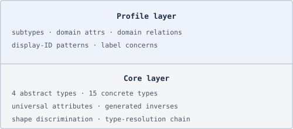

# MarkSpec Model Reference

MarkSpec parses Markdown and source-file doc comments into a structured **item
graph** — a directed graph of typed, identified items connected by typed trace
relations. This reference book is the complete, standalone description of that
model.

## Two-layer architecture

The model is divided into two layers:

**Core layer** — built into the toolchain. Four abstract types and fifteen
concrete types cover the vocabulary needed for any traceable documentation
project. Core also defines the universal attributes (`Id`, `Type`, `Labels`, …),
the shape-discrimination rule (ULID vs. URI), and the 8-step type-resolution
chain. Core behavior is version-locked and cannot be overridden by profiles.

**Profile layer** — domain-specific extensions declared in a `markspec.yaml`
manifest. A profile can add subtypes (e.g., `requirement extends Requirement`
with a display-ID pattern), domain attributes (e.g., `ASIL`, `Priority`), domain
relations (e.g., `Mitigated-by`), label concerns, and document conventions. A
project activates profiles via `.markspec.yaml`. When no profile is configured
the toolchain runs in core-only mode.

## Key concepts

**Entry** — the atomic unit of the model. Every entry has:

- A **display ID** — human-readable, e.g., `SRS_BRK_0107`
- A **title** — the first line of the Markdown list item
- A **body** — prose paragraphs describing the item
- A **trailer block** — indented key-value attributes (`Id:`, `Type:`,
  `Labels:`, …)

**Shape** — determined solely by the `Id:` value. Exactly two shapes exist:

- **Authored** — `Id:` is a bare ULID (`01HGW2Q8MNP3RSTVWXYZABCDEF`). The item
  originated in this project; ULIDs are assigned by `markspec fmt`.
- **Reference** — `Id:` is a URI with scheme (`urn:`, `doi:`, `pkg:`, `https:`).
  The item is an external standard, package, or open-source dependency.

**Type** — resolved from the `Type:` trailer attribute via an 8-step chain.
Profiles declare concrete subtypes that `extends:` a core type. The final
fallback is `Item`. Type and shape are orthogonal — any type can be either
shape.

**Relation** — a typed, directed edge in the trace graph written as a trailer
attribute (`Satisfies: SYS_BRK_0042`). MarkSpec generates inverse edges
automatically in the compiled output (`Satisfied-by`). The author only writes
the forward edge.

## Reading guide

| Chapter                                             | What it covers                                                                    |
| --------------------------------------------------- | --------------------------------------------------------------------------------- |
| [Entry format](entry-format.md)                     | Syntax and anatomy of entry blocks; the two shapes; in-source entries             |
| [Type taxonomy](types.md)                           | The 4 abstract and 15 concrete types; the type-resolution chain; profile subtypes |
| [Attributes](attributes.md)                         | Universal attributes; per-type typical attributes; multi-value rules              |
| [Trace relations](relations.md)                     | Core relations; generated inverses; the trace graph                               |
| [Profiles and extensions](profiles.md)              | Profile manifests; the extends chain; core-only mode; bundled profiles            |
| [Annex A — Compile output](annex-compile-output.md) | The `/api/` directory layout; manifest, entry, and edge schemas; federation       |
