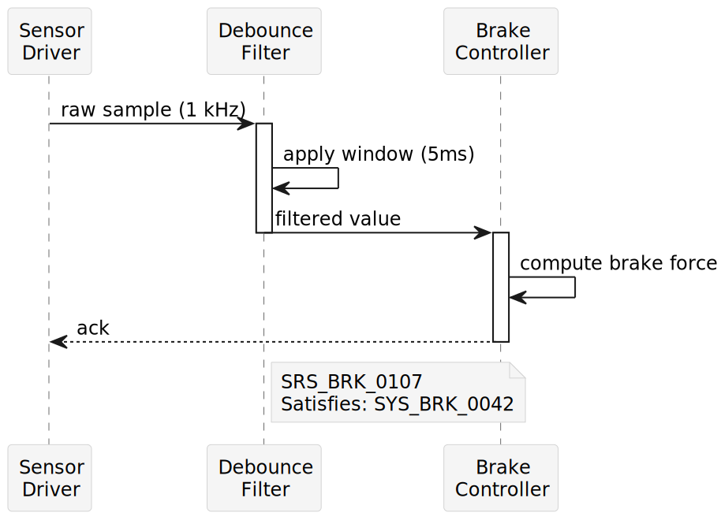
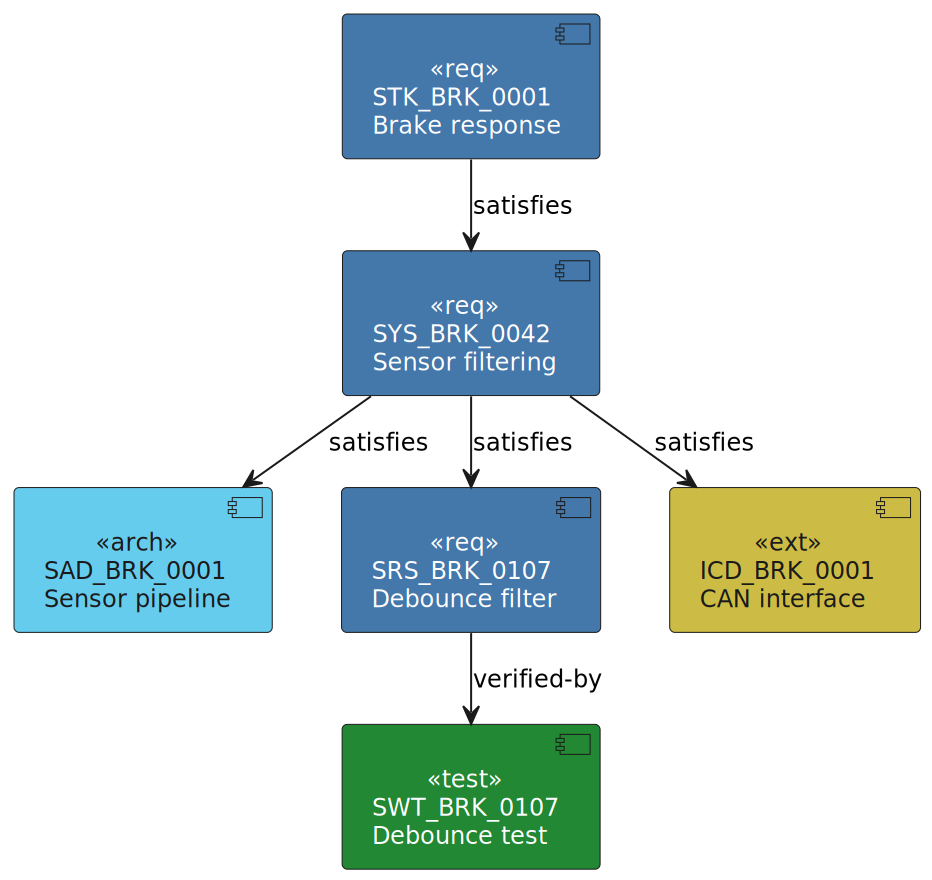

<!-- markdownlint-disable no-inline-html line-length -->

# Typography

This chapter defines the typographic system for MarkSpec rendered output (PDF
documents, HTML books, slide decks). All values are defaults — authors may
override them in `project.yaml`.

## Fonts

IBM Plex is chosen for its technical clarity, broad Unicode coverage, and open
license. It ships in Sans, Mono, and Serif variants — covering all document
roles without mixing font families.

<svg xmlns="http://www.w3.org/2000/svg" viewBox="0 0 700 130" style="background:#ffffff; border:1px solid #d4d4d4; border-radius:3px">
  <text x="20" y="28" font-family="sans-serif" font-size="14" font-weight="600" fill="#1a1a1a">Sans Regular —</text>
  <text x="155" y="28" font-family="sans-serif" font-size="14" fill="#1a1a1a">The braking system shall achieve full braking force within 150ms.</text>
  <text x="20" y="52" font-family="sans-serif" font-size="14" font-weight="600" fill="#1a1a1a">Sans Italic —</text>
  <text x="145" y="52" font-family="sans-serif" font-size="14" font-style="italic" fill="#1a1a1a">Table: Sensor thresholds for the braking ECU</text>
  <text x="20" y="76" font-family="sans-serif" font-size="14" font-weight="600" fill="#1a1a1a">Sans SemiBold —</text>
  <text x="170" y="76" font-family="sans-serif" font-size="14" font-weight="600" fill="#1a1a1a">Sensor noise filtering</text>
  <text x="20" y="100" font-family="monospace" font-size="13" font-weight="600" fill="#1a1a1a">Mono Regular —</text>
  <text x="160" y="100" font-family="monospace" font-size="13" fill="#1a1a1a">Id: SRS_01HGW2Q8MNP3 | Satisfies: SYS_BRK_0042</text>
  <text x="20" y="122" font-family="serif" font-size="14" font-weight="600" fill="#1a1a1a">Serif Regular —</text>
  <text x="155" y="122" font-family="serif" font-size="14" fill="#1a1a1a">The design philosophy prioritizes simplicity as a discipline.</text>
</svg>

_Figure: IBM Plex font roles_

The font family is **IBM Plex** — a typeface designed for technical
documentation with broad Unicode coverage, multiple weights, and native support
for tabular figures.

| Role          | Family         | Weight         | Usage                                    |
| ------------- | -------------- | -------------- | ---------------------------------------- |
| Body text     | IBM Plex Sans  | Regular (400)  | Paragraphs, list items, captions         |
| Body emphasis | IBM Plex Sans  | Italic (400)   | Emphasized text                          |
| Body strong   | IBM Plex Sans  | SemiBold (600) | Strong text, headings                    |
| Monospace     | IBM Plex Mono  | Regular (400)  | Code blocks, inline code, entry IDs      |
| Long prose    | IBM Plex Serif | Regular (400)  | Optional — for narrative-heavy documents |

Only Sans and Mono are required. Serif is available for projects that prefer it
for body text.

### Font fallback chain

IBM Plex is open-source (OFL) and bundled in CI. For contexts where Plex is not
installed (local preview, SVGs viewed on GitHub), use this fallback chain:

| Role  | Fallback chain                                                               |
| ----- | ---------------------------------------------------------------------------- |
| Sans  | `"IBM Plex Sans", "Segoe UI", "Helvetica Neue", "DejaVu Sans", sans-serif`   |
| Mono  | `"IBM Plex Mono", "Cascadia Mono", "SF Mono", "DejaVu Sans Mono", monospace` |
| Serif | `"IBM Plex Serif", "Georgia", "DejaVu Serif", serif`                         |

The chain picks the best match per platform: Segoe UI on Windows, Helvetica Neue
on macOS, DejaVu Sans on Linux. The final generic keyword (`sans-serif`,
`monospace`, `serif`) ensures a last resort on any system.

PlantUML only accepts a single font name — no fallback chain. Use IBM Plex Sans
and ensure the font is installed on the build machine. When Plex is not
available, PlantUML falls back to its built-in SansSerif.

## Type scale

The minor third ratio (1.2) produces a compact scale that works for technical
documents where space is at a premium. Larger ratios (e.g., major third 1.25)
waste vertical space; smaller ratios lack visual hierarchy.

<svg xmlns="http://www.w3.org/2000/svg" viewBox="0 0 700 160" style="background:#ffffff; border:1px solid #d4d4d4; border-radius:3px">
  <text x="20" y="32" font-family="sans-serif" font-size="27" font-weight="600" fill="#1a1a1a">H1 — Section title (20pt)</text>
  <text x="20" y="60" font-family="sans-serif" font-size="22" font-weight="600" fill="#1a1a1a">H2 — Subsection (16.5pt)</text>
  <text x="20" y="84" font-family="sans-serif" font-size="19" font-weight="600" fill="#1a1a1a">H3 — Topic (14pt)</text>
  <text x="20" y="106" font-family="sans-serif" font-size="16" font-weight="600" fill="#1a1a1a">H4 — Subtopic (12pt)</text>
  <text x="20" y="126" font-family="sans-serif" font-size="13" fill="#1a1a1a">Body text at 10pt — the sensor driver shall debounce raw inputs.</text>
  <text x="20" y="146" font-family="sans-serif" font-size="11" fill="#6b6b6b" font-style="italic">Caption at 8.5pt — Table: Sensor thresholds</text>
</svg>

_Figure: Type scale hierarchy_

Sizes follow a minor third ratio (1.2) rounded to half-points. The base size is
10pt for A4 documents.

| Element         | Size   | Weight         | Leading |
| --------------- | ------ | -------------- | ------- |
| H1              | 20pt   | SemiBold       | 24pt    |
| H2              | 16.5pt | SemiBold       | 20pt    |
| H3              | 14pt   | SemiBold       | 17pt    |
| H4              | 12pt   | SemiBold       | 15pt    |
| Body            | 10pt   | Regular        | 14pt    |
| Small / caption | 8.5pt  | Regular        | 12pt    |
| Code block      | 9pt    | Regular (Mono) | 13pt    |
| Inline code     | 9pt    | Regular (Mono) | —       |
| Footer / header | 8pt    | Regular        | 10pt    |

## Page layout

A4 with 25 mm margins gives a 160 mm text width — comfortable for 10pt body text
at roughly 80 characters per line, matching the Markdown source line width.

<svg xmlns="http://www.w3.org/2000/svg" viewBox="0 0 500 400" style="background:#e8e8e8; border:1px solid #d4d4d4; border-radius:3px">
  <!-- Page (A4 ratio 1:1.414 → 260×368) -->
  <rect x="120" y="10" width="260" height="368" fill="#ffffff" stroke="#1a1a1a" stroke-width="0.5"/>
  <!-- Margins -->
  <rect x="151" y="54" width="198" height="280" fill="none" stroke="#0072B2" stroke-width="0.5" stroke-dasharray="4,3"/>
  <!-- Margin labels -->
  <text x="250" y="38" text-anchor="middle" font-family="sans-serif" font-size="9" fill="#0072B2">25 mm</text>
  <text x="250" y="362" text-anchor="middle" font-family="sans-serif" font-size="9" fill="#0072B2">25 mm</text>
  <text x="135" y="194" text-anchor="middle" font-family="sans-serif" font-size="9" fill="#0072B2" transform="rotate(-90,135,194)">25 mm</text>
  <text x="365" y="194" text-anchor="middle" font-family="sans-serif" font-size="9" fill="#0072B2" transform="rotate(90,365,194)">25 mm</text>
  <!-- Header -->
  <text x="151" y="66" font-family="sans-serif" font-size="7" fill="#6b6b6b">Document title</text>
  <text x="349" y="66" text-anchor="end" font-family="sans-serif" font-size="7" fill="#6b6b6b">1</text>
  <line x1="151" y1="69" x2="349" y2="69" stroke="#d4d4d4" stroke-width="0.5"/>
  <!-- Content wireframe -->
  <text x="151" y="86" font-family="sans-serif" font-size="10" font-weight="600" fill="#1a1a1a">Sensor noise filtering</text>
  <rect x="151" y="92" width="150" height="4" rx="1" fill="#d4d4d4"/>
  <rect x="151" y="100" width="175" height="4" rx="1" fill="#d4d4d4"/>
  <rect x="151" y="108" width="130" height="4" rx="1" fill="#d4d4d4"/>
  <rect x="151" y="120" width="160" height="4" rx="1" fill="#d4d4d4"/>
  <rect x="151" y="128" width="140" height="4" rx="1" fill="#d4d4d4"/>
  <!-- Code block -->
  <rect x="151" y="142" width="198" height="28" rx="3" fill="#f5f5f5" stroke="#d4d4d4" stroke-width="0.5"/>
  <rect x="159" y="149" width="110" height="3" rx="1" fill="#999999"/>
  <rect x="159" y="156" width="80" height="3" rx="1" fill="#999999"/>
  <!-- More text -->
  <rect x="151" y="180" width="160" height="4" rx="1" fill="#d4d4d4"/>
  <rect x="151" y="188" width="175" height="4" rx="1" fill="#d4d4d4"/>
  <rect x="151" y="196" width="140" height="4" rx="1" fill="#d4d4d4"/>
  <!-- Table -->
  <rect x="151" y="210" width="198" height="12" fill="#f5f5f5" stroke="#d4d4d4" stroke-width="0.5"/>
  <rect x="151" y="222" width="198" height="10" fill="#ffffff" stroke="#d4d4d4" stroke-width="0.5"/>
  <rect x="151" y="232" width="198" height="10" fill="#ffffff" stroke="#d4d4d4" stroke-width="0.5"/>
  <!-- More text -->
  <rect x="151" y="254" width="170" height="4" rx="1" fill="#d4d4d4"/>
  <rect x="151" y="262" width="155" height="4" rx="1" fill="#d4d4d4"/>
  <!-- Footer -->
  <line x1="151" y1="320" x2="349" y2="320" stroke="#d4d4d4" stroke-width="0.5"/>
  <text x="151" y="330" font-family="sans-serif" font-size="7" fill="#6b6b6b">MarkSpec v0.0.3</text>
  <text x="349" y="330" text-anchor="end" font-family="sans-serif" font-size="7" fill="#6b6b6b">2026-03-23</text>
  <!-- Dimension labels -->
  <text x="250" y="392" text-anchor="middle" font-family="sans-serif" font-size="8" fill="#999999">210 mm</text>
  <text x="392" y="194" text-anchor="middle" font-family="sans-serif" font-size="8" fill="#999999" transform="rotate(90,392,194)">297 mm</text>
</svg>

_Figure: A4 page layout with margins, header, and footer_

Default page size is **A4** (210 × 297 mm), portrait orientation.

| Property          | Value                                         |
| ----------------- | --------------------------------------------- |
| Page size         | A4 (210 × 297 mm)                             |
| Top margin        | 25 mm                                         |
| Bottom margin     | 25 mm                                         |
| Left margin       | 25 mm                                         |
| Right margin      | 25 mm                                         |
| Header            | Document title (left), page number (right)    |
| Footer            | Project name and version (left), date (right) |
| Column count      | 1                                             |
| Paragraph spacing | 6pt after                                     |
| Paragraph indent  | None (block style)                            |

## Color palette

### Document palette (default)

Monochrome with one accent ensures B&W printability — critical for auditor
handoffs and archived compliance documentation.

<svg xmlns="http://www.w3.org/2000/svg" viewBox="0 0 700 60" style="background:#ffffff; border:1px solid #d4d4d4; border-radius:3px">
  <rect x="10" y="10" width="70" height="40" rx="4" fill="#1a1a1a"/><text x="45" y="34" text-anchor="middle" font-family="sans-serif" font-size="8" fill="#ffffff">text</text>
  <rect x="90" y="10" width="70" height="40" rx="4" fill="#6b6b6b"/><text x="125" y="34" text-anchor="middle" font-family="sans-serif" font-size="8" fill="#ffffff">secondary</text>
  <rect x="170" y="10" width="70" height="40" rx="4" fill="#999999"/><text x="205" y="34" text-anchor="middle" font-family="sans-serif" font-size="8" fill="#ffffff">muted</text>
  <rect x="250" y="10" width="70" height="40" rx="4" fill="#0072B2"/><text x="285" y="34" text-anchor="middle" font-family="sans-serif" font-size="8" fill="#ffffff">accent</text>
  <rect x="330" y="10" width="70" height="40" rx="4" fill="#005580"/><text x="365" y="34" text-anchor="middle" font-family="sans-serif" font-size="8" fill="#ffffff">accent-dark</text>
  <rect x="410" y="10" width="70" height="40" rx="4" fill="#f5f5f5" stroke="#d4d4d4" stroke-width="0.5"/><text x="445" y="34" text-anchor="middle" font-family="sans-serif" font-size="8" fill="#1a1a1a">bg-code</text>
  <rect x="490" y="10" width="70" height="40" rx="4" fill="#f0f4f8" stroke="#d4d4d4" stroke-width="0.5"/><text x="525" y="34" text-anchor="middle" font-family="sans-serif" font-size="8" fill="#1a1a1a">bg-alert</text>
  <rect x="570" y="10" width="70" height="40" rx="4" fill="#d4d4d4"/><text x="605" y="34" text-anchor="middle" font-family="sans-serif" font-size="8" fill="#1a1a1a">border</text>
</svg>

_Figure: Document palette swatches_

The document palette is monochrome with a single accent color. All content
remains legible in greyscale print and B&W photocopy.

| Token         | Hex       | Usage                                    |
| ------------- | --------- | ---------------------------------------- |
| `text`        | `#1a1a1a` | Body text, headings                      |
| `secondary`   | `#6b6b6b` | Captions, metadata, footer               |
| `muted`       | `#999999` | Disabled, placeholder                    |
| `accent`      | `#0072B2` | Links, cross-references, active elements |
| `accent-dark` | `#005580` | Visited links, hover state               |
| `bg-code`     | `#f5f5f5` | Code block background                    |
| `bg-alert`    | `#f0f4f8` | Alert/admonition background              |
| `border`      | `#d4d4d4` | Table rules, dividers, code block border |
| `white`       | `#ffffff` | Page background                          |

### Diagram palette (categorical)

The Paul Tol qualitative palette is designed for scientific publishing and
tested under protanopia, deuteranopia, and tritanopia.

<svg xmlns="http://www.w3.org/2000/svg" viewBox="0 0 700 60" style="background:#ffffff; border:1px solid #d4d4d4; border-radius:3px">
  <rect x="10" y="10" width="80" height="40" rx="4" fill="#4477AA"/><text x="50" y="34" text-anchor="middle" font-family="sans-serif" font-size="9" fill="#ffffff">Blue</text>
  <rect x="100" y="10" width="80" height="40" rx="4" fill="#66CCEE"/><text x="140" y="34" text-anchor="middle" font-family="sans-serif" font-size="9" fill="#1a1a1a">Cyan</text>
  <rect x="190" y="10" width="80" height="40" rx="4" fill="#228833"/><text x="230" y="34" text-anchor="middle" font-family="sans-serif" font-size="9" fill="#ffffff">Green</text>
  <rect x="280" y="10" width="80" height="40" rx="4" fill="#CCBB44"/><text x="320" y="34" text-anchor="middle" font-family="sans-serif" font-size="9" fill="#1a1a1a">Yellow</text>
  <rect x="370" y="10" width="80" height="40" rx="4" fill="#EE6677"/><text x="410" y="34" text-anchor="middle" font-family="sans-serif" font-size="9" fill="#ffffff">Red</text>
  <rect x="460" y="10" width="80" height="40" rx="4" fill="#AA3377"/><text x="500" y="34" text-anchor="middle" font-family="sans-serif" font-size="9" fill="#ffffff">Purple</text>
  <rect x="550" y="10" width="60" height="40" rx="4" fill="#BBBBBB"/><text x="580" y="34" text-anchor="middle" font-family="sans-serif" font-size="9" fill="#1a1a1a">Grey</text>
  <rect x="620" y="10" width="60" height="40" rx="4" fill="#999999"/><text x="650" y="34" text-anchor="middle" font-family="sans-serif" font-size="9" fill="#ffffff">Dark</text>
</svg>

_Figure: Paul Tol qualitative palette_

When a diagram requires categorical distinction (e.g., component types, data
flows, requirement layers), use the Paul Tol qualitative palette. These eight
colors are designed to remain distinguishable under all forms of color
blindness.

| Name      | Hex       |
| --------- | --------- |
| Blue      | `#4477AA` |
| Cyan      | `#66CCEE` |
| Green     | `#228833` |
| Yellow    | `#CCBB44` |
| Red       | `#EE6677` |
| Purple    | `#AA3377` |
| Grey      | `#BBBBBB` |
| Dark grey | `#999999` |

When categorical distinction is not needed, diagrams use the document palette
(monochrome + accent).

### Alert colors

<svg xmlns="http://www.w3.org/2000/svg" viewBox="0 0 700 170" style="background:#ffffff; border:1px solid #d4d4d4; border-radius:3px">
  <rect x="10" y="10" width="330" height="26" rx="3" fill="#f0f4f8"/><rect x="10" y="10" width="4" height="26" rx="2" fill="#4477AA"/>
  <text x="24" y="27" font-family="sans-serif" font-size="10" font-weight="600" fill="#1a1a1a">Note</text><text x="60" y="27" font-family="sans-serif" font-size="10" fill="#1a1a1a">— informational context for the reader.</text>
  <rect x="10" y="44" width="330" height="26" rx="3" fill="#f0f8f2"/><rect x="10" y="44" width="4" height="26" rx="2" fill="#228833"/>
  <text x="24" y="61" font-family="sans-serif" font-size="10" font-weight="600" fill="#1a1a1a">Tip</text><text x="48" y="61" font-family="sans-serif" font-size="10" fill="#1a1a1a">— helpful suggestion for the reader.</text>
  <rect x="10" y="78" width="330" height="26" rx="3" fill="#f8f0f6"/><rect x="10" y="78" width="4" height="26" rx="2" fill="#AA3377"/>
  <text x="24" y="95" font-family="sans-serif" font-size="10" font-weight="600" fill="#1a1a1a">Important</text><text x="88" y="95" font-family="sans-serif" font-size="10" fill="#1a1a1a">— key information the reader must know.</text>
  <rect x="10" y="112" width="330" height="26" rx="3" fill="#f8f6f0"/><rect x="10" y="112" width="4" height="26" rx="2" fill="#CCBB44"/>
  <text x="24" y="129" font-family="sans-serif" font-size="10" font-weight="600" fill="#1a1a1a">Warning</text><text x="78" y="129" font-family="sans-serif" font-size="10" fill="#1a1a1a">— potential issue the reader should avoid.</text>
  <rect x="10" y="146" width="330" height="26" rx="3" fill="#f8f0f0"/><rect x="10" y="146" width="4" height="26" rx="2" fill="#EE6677"/>
  <text x="24" y="163" font-family="sans-serif" font-size="10" font-weight="600" fill="#1a1a1a">Caution</text><text x="78" y="163" font-family="sans-serif" font-size="10" fill="#1a1a1a">— action may cause data loss or harm.</text>
</svg>

_Figure: Alert rendering with Tol border colors_

Alerts inherit the document palette. The left border uses a severity-appropriate
shade from the Tol palette.

| Alert     | Border color       | Background |
| --------- | ------------------ | ---------- |
| NOTE      | `#4477AA` (blue)   | `#f0f4f8`  |
| TIP       | `#228833` (green)  | `#f0f8f2`  |
| IMPORTANT | `#AA3377` (purple) | `#f8f0f6`  |
| WARNING   | `#CCBB44` (yellow) | `#f8f6f0`  |
| CAUTION   | `#EE6677` (red)    | `#f8f0f0`  |

## Spacing

A 4pt base unit keeps spacing consistent and proportional. All values are
multiples of 4 — no magic numbers, easy to reason about.

<svg xmlns="http://www.w3.org/2000/svg" viewBox="0 0 700 190" style="background:#ffffff; border:1px solid #d4d4d4; border-radius:3px">
  <!-- H2 -->
  <text x="20" y="24" font-family="sans-serif" font-size="16" font-weight="600" fill="#1a1a1a">Sensor noise filtering</text>
  <!-- space-6 bracket -->
  <line x1="680" y1="28" x2="680" y2="52" stroke="#0072B2" stroke-width="0.5"/><text x="670" y="44" text-anchor="end" font-family="sans-serif" font-size="8" fill="#0072B2">space-6</text>
  <!-- H3 -->
  <text x="20" y="56" font-family="sans-serif" font-size="13" font-weight="600" fill="#1a1a1a">Debounce strategy</text>
  <!-- space-4 bracket -->
  <line x1="680" y1="60" x2="680" y2="76" stroke="#0072B2" stroke-width="0.5"/><text x="670" y="72" text-anchor="end" font-family="sans-serif" font-size="8" fill="#0072B2">space-4</text>
  <!-- Paragraph 1 -->
  <rect x="20" y="80" width="500" height="6" rx="1" fill="#d4d4d4"/>
  <rect x="20" y="94" width="460" height="6" rx="1" fill="#d4d4d4"/>
  <rect x="20" y="108" width="380" height="6" rx="1" fill="#d4d4d4"/>
  <!-- space-3 bracket -->
  <line x1="680" y1="112" x2="680" y2="124" stroke="#0072B2" stroke-width="0.5"/><text x="670" y="122" text-anchor="end" font-family="sans-serif" font-size="8" fill="#0072B2">space-3</text>
  <!-- Paragraph 2 -->
  <rect x="20" y="128" width="480" height="6" rx="1" fill="#d4d4d4"/>
  <rect x="20" y="142" width="520" height="6" rx="1" fill="#d4d4d4"/>
  <rect x="20" y="156" width="300" height="6" rx="1" fill="#d4d4d4"/>
  <!-- space-2 bracket -->
  <line x1="680" y1="164" x2="680" y2="172" stroke="#0072B2" stroke-width="0.5"/><text x="670" y="172" text-anchor="end" font-family="sans-serif" font-size="8" fill="#0072B2">space-2</text>
  <!-- List items -->
  <circle cx="30" cy="175" r="2" fill="#1a1a1a"/>
  <rect x="40" y="172" width="300" height="5" rx="1" fill="#d4d4d4"/>
  <circle cx="30" cy="186" r="2" fill="#1a1a1a"/>
  <rect x="40" y="183" width="280" height="5" rx="1" fill="#d4d4d4"/>
</svg>

_Figure: Spacing scale applied to document structure_

A 4pt base unit defines the spacing scale. All vertical and horizontal spacing
derives from multiples of this unit.

| Token     | Value | Usage                               |
| --------- | ----- | ----------------------------------- |
| `space-1` | 4pt   | Inline padding, tight gaps          |
| `space-2` | 8pt   | Between list items, cell padding    |
| `space-3` | 12pt  | Between paragraphs within a section |
| `space-4` | 16pt  | Between sections (below headings)   |
| `space-6` | 24pt  | Between major sections (below H2)   |
| `space-8` | 32pt  | Page-level separation               |

## Tables

<svg xmlns="http://www.w3.org/2000/svg" viewBox="0 0 700 120" style="background:#ffffff; border:1px solid #d4d4d4; border-radius:3px">
  <!-- Caption -->
  <text x="20" y="20" font-family="sans-serif" font-size="10" font-style="italic" fill="#6b6b6b">Table: Sensor thresholds</text>
  <!-- Header row -->
  <rect x="20" y="30" width="400" height="24" fill="#f5f5f5" stroke="#d4d4d4" stroke-width="0.5"/>
  <text x="30" y="46" font-family="sans-serif" font-size="10" font-weight="600" fill="#1a1a1a">Sensor</text>
  <text x="170" y="46" font-family="sans-serif" font-size="10" font-weight="600" fill="#1a1a1a">Min</text>
  <text x="270" y="46" font-family="sans-serif" font-size="10" font-weight="600" fill="#1a1a1a">Max</text>
  <text x="370" y="46" font-family="sans-serif" font-size="10" font-weight="600" fill="#1a1a1a">Unit</text>
  <!-- Row 1 -->
  <rect x="20" y="54" width="400" height="24" fill="#ffffff" stroke="#d4d4d4" stroke-width="0.5"/>
  <text x="30" y="70" font-family="sans-serif" font-size="10" fill="#1a1a1a">Pressure</text>
  <text x="170" y="70" font-family="sans-serif" font-size="10" fill="#1a1a1a">0</text>
  <text x="270" y="70" font-family="sans-serif" font-size="10" fill="#1a1a1a">1023</text>
  <text x="370" y="70" font-family="sans-serif" font-size="10" fill="#1a1a1a">raw</text>
  <!-- Row 2 -->
  <rect x="20" y="78" width="400" height="24" fill="#ffffff" stroke="#d4d4d4" stroke-width="0.5"/>
  <text x="30" y="94" font-family="sans-serif" font-size="10" fill="#1a1a1a">Temperature</text>
  <text x="170" y="94" font-family="sans-serif" font-size="10" fill="#1a1a1a">-40</text>
  <text x="270" y="94" font-family="sans-serif" font-size="10" fill="#1a1a1a">150</text>
  <text x="370" y="94" font-family="sans-serif" font-size="10" fill="#1a1a1a">°C</text>
  <!-- Column lines -->
  <line x1="160" y1="30" x2="160" y2="102" stroke="#d4d4d4" stroke-width="0.5"/>
  <line x1="260" y1="30" x2="260" y2="102" stroke="#d4d4d4" stroke-width="0.5"/>
  <line x1="360" y1="30" x2="360" y2="102" stroke="#d4d4d4" stroke-width="0.5"/>
</svg>

_Figure: Table rendering with caption, header, and borders_

| Property          | Value                             |
| ----------------- | --------------------------------- |
| Header background | `#f5f5f5`                         |
| Header weight     | SemiBold                          |
| Cell padding      | 4pt vertical, 8pt horizontal      |
| Border            | `#d4d4d4`, 0.5pt solid            |
| Alternating rows  | None (clean default)              |
| Caption position  | Above table, italic, `text` color |

## Code blocks

<svg xmlns="http://www.w3.org/2000/svg" viewBox="0 0 700 100" style="background:#ffffff; border:1px solid #d4d4d4; border-radius:3px">
  <rect x="20" y="10" width="660" height="80" rx="3" fill="#f5f5f5" stroke="#d4d4d4" stroke-width="0.5"/>
  <text x="32" y="30" font-family="monospace" font-size="11" font-weight="700" fill="#1a1a1a">fun</text>
  <text x="60" y="30" font-family="monospace" font-size="11" fill="#1a1a1a">debounce(raw:</text>
  <text x="176" y="30" font-family="monospace" font-size="11" font-weight="700" fill="#1a1a1a">Int</text>
  <text x="200" y="30" font-family="monospace" font-size="11" fill="#1a1a1a">):</text>
  <text x="216" y="30" font-family="monospace" font-size="11" font-weight="700" fill="#1a1a1a">Int</text>
  <text x="240" y="30" font-family="monospace" font-size="11" fill="#1a1a1a">{</text>
  <text x="44" y="48" font-family="monospace" font-size="11" fill="#6b6b6b" font-style="italic">// filter noise below threshold</text>
  <text x="44" y="66" font-family="monospace" font-size="11" font-weight="700" fill="#1a1a1a">return</text>
  <text x="98" y="66" font-family="monospace" font-size="11" fill="#1a1a1a">filtered</text>
  <text x="32" y="84" font-family="monospace" font-size="11" fill="#1a1a1a">}</text>
  <!-- Legend -->
  <text x="450" y="30" font-family="sans-serif" font-size="9" fill="#1a1a1a"><tspan font-weight="700">bold</tspan> = keywords</text>
  <text x="450" y="48" font-family="sans-serif" font-size="9" fill="#6b6b6b"><tspan font-style="italic">italic</tspan> = comments</text>
  <text x="450" y="66" font-family="sans-serif" font-size="9" fill="#1a1a1a">regular = identifiers</text>
</svg>

_Figure: Monochrome syntax highlighting_

| Property            | Value                                                            |
| ------------------- | ---------------------------------------------------------------- |
| Font                | IBM Plex Mono, 9pt                                               |
| Background          | `#f5f5f5`                                                        |
| Border              | `#d4d4d4`, 0.5pt solid                                           |
| Border radius       | 3pt                                                              |
| Padding             | 12pt                                                             |
| Line numbers        | Off by default                                                   |
| Syntax highlighting | Monochrome — keywords bold, strings italic, comments `secondary` |

Syntax highlighting uses weight and style variation rather than color to remain
legible in B&W.

## Links

<svg xmlns="http://www.w3.org/2000/svg" viewBox="0 0 700 50" style="background:#ffffff; border:1px solid #d4d4d4; border-radius:3px">
  <text x="20" y="22" font-family="sans-serif" font-size="12" fill="#1a1a1a">This module implements </text>
  <text x="195" y="22" font-family="sans-serif" font-size="12" fill="#0072B2" text-decoration="underline">SRS_BRK_0107</text>
  <text x="305" y="22" font-family="sans-serif" font-size="12" fill="#1a1a1a">. See </text>
  <text x="340" y="22" font-family="sans-serif" font-size="12" fill="#0072B2" text-decoration="underline">ADR-003</text>
  <text x="405" y="22" font-family="sans-serif" font-size="12" fill="#1a1a1a"> for diagram rules.</text>
  <text x="20" y="42" font-family="sans-serif" font-size="12" fill="#1a1a1a">Inline code </text>
  <rect x="103" y="30" width="130" height="16" rx="3" fill="#f5f5f5" stroke="#d4d4d4" stroke-width="0.5"/>
  <text x="110" y="42" font-family="monospace" font-size="11" fill="#1a1a1a">SRS_BRK_0107</text>
  <text x="240" y="42" font-family="sans-serif" font-size="12" fill="#1a1a1a"> is not clickable.</text>
</svg>

_Figure: Resolved references vs inline code_

| Context                | Font               | Color    | Underline                   | Clickable |
| ---------------------- | ------------------ | -------- | --------------------------- | --------- |
| `[text](url)` in prose | Surrounding (Sans) | `accent` | PDF: always, HTML: on hover | Yes       |
| `<url>` autolink       | Mono               | `accent` | PDF: always, HTML: on hover | Yes       |
| `` `code` `` inline    | Mono               | `text`   | None                        | No        |
| `{{ref.ID}}` resolved  | Sans               | `accent` | PDF: always, HTML: on hover | Yes       |
| URL inside code fence  | Mono               | `text`   | None                        | No        |
| Footnote marker        | Sans, superscript  | `accent` | None                        | Yes       |

Mustache references (`{{namespace.id}}`) are resolved by tooling before
rendering. In the output they appear as regular cross-reference links, not as
code. URLs and code literals inside fenced code blocks are never linked — code
blocks are inert.

## Captions

| Property       | Value                                       |
| -------------- | ------------------------------------------- |
| Font           | IBM Plex Sans, 8.5pt, italic                |
| Color          | `secondary` (`#6b6b6b`)                     |
| Table caption  | Above the table                             |
| Figure caption | Below the image                             |
| Spacing        | `space-2` (8pt) between caption and content |

## Cover page

<svg xmlns="http://www.w3.org/2000/svg" viewBox="0 0 500 400" style="background:#e8e8e8; border:1px solid #d4d4d4; border-radius:3px">
  <!-- Page (A4 ratio 1:1.414 → 260×368) -->
  <rect x="120" y="10" width="260" height="368" fill="#ffffff" stroke="#1a1a1a" stroke-width="0.5"/>
  <text x="250" y="110" text-anchor="middle" font-family="sans-serif" font-size="20" font-weight="600" fill="#1a1a1a">MarkSpec</text>
  <text x="250" y="194" text-anchor="middle" font-family="sans-serif" font-size="14" font-weight="600" fill="#1a1a1a">Language Specification</text>
  <text x="250" y="214" text-anchor="middle" font-family="sans-serif" font-size="10" fill="#6b6b6b">v0.0.3</text>
  <text x="250" y="230" text-anchor="middle" font-family="sans-serif" font-size="9" fill="#6b6b6b">2026-03-23</text>
  <text x="250" y="320" text-anchor="middle" font-family="sans-serif" font-size="9" font-weight="600" fill="#0072B2">INTERNAL</text>
</svg>

_Figure: Cover page layout_

The cover page is generated from `project.yaml` metadata. Layout:

| Element        | Position               | Style                      |
| -------------- | ---------------------- | -------------------------- |
| Project name   | Upper third, centered  | 28pt, SemiBold             |
| Document title | Center, centered       | 20pt, SemiBold             |
| Version        | Below title            | 12pt, Regular, `secondary` |
| Date           | Below version          | 10pt, Regular, `secondary` |
| Classification | Bottom third, centered | 10pt, SemiBold, `accent`   |

The cover page has no header or footer.

## Diagrams

### Format and embedding

Diagrams are stored as SVG files alongside the documents that reference them.
Embedded using standard Markdown image syntax with relative paths:

```markdown

```

Always set the `viewBox` attribute. Omit fixed `width`/`height` — let the
container control display size. The same SVG works across PDF, HTML, and slide
output.

Set `font-family` on the root `<svg>` or on individual `<text>` elements using
the Sans fallback chain from the [Fonts section](#font-fallback-chain):

<svg xmlns="http://www.w3.org/2000/svg" viewBox="0 0 700 60" style="background:#f5f5f5; border:1px solid #d4d4d4; border-radius:3px">
  <rect x="20" y="10" width="200" height="40" rx="4" fill="#ffffff" stroke="#1a1a1a" stroke-width="1.5"/>
  <text x="120" y="36" text-anchor="middle" font-family="'IBM Plex Sans', 'Segoe UI', 'Helvetica Neue', sans-serif" font-size="12" fill="#1a1a1a">Component label</text>
</svg>

_Figure: SVG component with font fallback chain_

### SVG sizing for documents (A4, ~25 mm margins)

| Type              | Ratio | viewBox (w × h) | Use                                   |
| ----------------- | ----- | --------------- | ------------------------------------- |
| Full width        | 16:9  | 700 × 400       | Architecture overviews, flow diagrams |
| Full width tall   | 4:3   | 700 × 525       | Detailed system diagrams              |
| Full width square | 1:1   | 700 × 700       | State machines, class diagrams        |
| Half width        | 4:3   | 340 × 250       | Inline diagrams, small illustrations  |
| Full page         | 3:4   | 700 × 900       | Complex diagrams needing a full page  |

### SVG sizing for slides (16:9)

| Type         | Ratio | viewBox (w × h) | Use                         |
| ------------ | ----- | --------------- | --------------------------- |
| Full slide   | 16:9  | 1600 × 900      | Full bleed diagram          |
| Content area | 16:9  | 1400 × 780      | With title and margins      |
| Half slide   | 9:10  | 700 × 780       | Diagram + text side by side |
| Quarter      | 16:9  | 700 × 390       | Small inline diagram        |

### Visual style

<svg xmlns="http://www.w3.org/2000/svg" viewBox="0 0 700 280" style="border:1px solid #d4d4d4; border-radius:3px; background:#ffffff">
  <!-- Title -->
  <text x="350" y="24" text-anchor="middle" font-family="sans-serif" font-size="14" font-weight="600" fill="#1a1a1a">Braking System — Software Architecture</text>
  <!-- Sensor Driver -->
  <rect x="40" y="50" width="160" height="60" rx="4" fill="#f5f5f5" stroke="#1a1a1a" stroke-width="1.5"/>
  <text x="120" y="76" text-anchor="middle" font-family="sans-serif" font-size="11" font-weight="600" fill="#1a1a1a">Sensor Driver</text>
  <text x="120" y="92" text-anchor="middle" font-family="monospace" font-size="8" fill="#6b6b6b">SRS_BRK_0107</text>
  <!-- Debounce Filter -->
  <rect x="270" y="50" width="160" height="60" rx="4" fill="#f5f5f5" stroke="#1a1a1a" stroke-width="1.5"/>
  <text x="350" y="76" text-anchor="middle" font-family="sans-serif" font-size="11" font-weight="600" fill="#1a1a1a">Debounce Filter</text>
  <text x="350" y="92" text-anchor="middle" font-family="monospace" font-size="8" fill="#6b6b6b">SRS_BRK_0108</text>
  <!-- Brake Controller -->
  <rect x="500" y="50" width="160" height="60" rx="4" fill="#f5f5f5" stroke="#1a1a1a" stroke-width="1.5"/>
  <text x="580" y="76" text-anchor="middle" font-family="sans-serif" font-size="11" font-weight="600" fill="#1a1a1a">Brake Controller</text>
  <text x="580" y="92" text-anchor="middle" font-family="monospace" font-size="8" fill="#6b6b6b">SRS_BRK_0109</text>
  <!-- Arrows -->
  <defs><marker id="arrow-mono" viewBox="0 0 10 10" refX="10" refY="5" markerWidth="8" markerHeight="8" orient="auto"><path d="M 0 0 L 10 5 L 0 10 z" fill="#1a1a1a"/></marker></defs>
  <line x1="200" y1="80" x2="268" y2="80" stroke="#1a1a1a" stroke-width="1.5" marker-end="url(#arrow-mono)"/>
  <line x1="430" y1="80" x2="498" y2="80" stroke="#1a1a1a" stroke-width="1.5" marker-end="url(#arrow-mono)"/>
  <text x="234" y="74" text-anchor="middle" font-family="sans-serif" font-size="9" fill="#6b6b6b">raw</text>
  <text x="464" y="74" text-anchor="middle" font-family="sans-serif" font-size="9" fill="#6b6b6b">filtered</text>
  <!-- CAN Bus -->
  <rect x="40" y="160" width="620" height="30" rx="4" fill="none" stroke="#1a1a1a" stroke-width="1" stroke-dasharray="6,3"/>
  <text x="350" y="180" text-anchor="middle" font-family="sans-serif" font-size="10" fill="#6b6b6b">CAN Bus</text>
  <line x1="120" y1="110" x2="120" y2="158" stroke="#1a1a1a" stroke-width="1"/>
  <line x1="580" y1="110" x2="580" y2="158" stroke="#1a1a1a" stroke-width="1"/>
  <!-- Note -->
  <rect x="40" y="220" width="250" height="40" rx="3" fill="#f5f5f5" stroke="#d4d4d4" stroke-width="0.5"/>
  <text x="50" y="238" font-family="sans-serif" font-size="9" fill="#6b6b6b">Debounce window: 5ms (configurable)</text>
  <text x="50" y="252" font-family="sans-serif" font-size="9" fill="#6b6b6b">Satisfies: SYS_BRK_0042</text>
</svg>

_Figure: Monochrome architecture diagram (document palette)_

<svg xmlns="http://www.w3.org/2000/svg" viewBox="0 0 700 220" style="border:1px solid #d4d4d4; border-radius:3px; background:#ffffff">
  <text x="350" y="24" text-anchor="middle" font-family="sans-serif" font-size="14" font-weight="600" fill="#1a1a1a">Requirement Layers</text>
  <!-- STK -->
  <rect x="270" y="44" width="160" height="36" rx="4" fill="#4477AA"/>
  <text x="350" y="67" text-anchor="middle" font-family="sans-serif" font-size="11" font-weight="600" fill="#ffffff">STK — Stakeholder</text>
  <!-- SYS -->
  <rect x="170" y="100" width="160" height="36" rx="4" fill="#66CCEE"/>
  <text x="250" y="123" text-anchor="middle" font-family="sans-serif" font-size="11" font-weight="600" fill="#1a1a1a">SYS — System</text>
  <!-- ICD -->
  <rect x="370" y="100" width="160" height="36" rx="4" fill="#CCBB44"/>
  <text x="450" y="123" text-anchor="middle" font-family="sans-serif" font-size="11" font-weight="600" fill="#1a1a1a">ICD — Interface</text>
  <!-- SRS -->
  <rect x="70" y="156" width="160" height="36" rx="4" fill="#228833"/>
  <text x="150" y="179" text-anchor="middle" font-family="sans-serif" font-size="11" font-weight="600" fill="#ffffff">SRS — Software</text>
  <!-- SAD -->
  <rect x="270" y="156" width="160" height="36" rx="4" fill="#AA3377"/>
  <text x="350" y="179" text-anchor="middle" font-family="sans-serif" font-size="11" font-weight="600" fill="#ffffff">SAD — Architecture</text>
  <!-- SWT -->
  <rect x="470" y="156" width="160" height="36" rx="4" fill="#EE6677"/>
  <text x="550" y="179" text-anchor="middle" font-family="sans-serif" font-size="11" font-weight="600" fill="#ffffff">SWT — Test</text>
  <!-- Arrows -->
  <defs><marker id="arrow-cat" viewBox="0 0 10 10" refX="10" refY="5" markerWidth="8" markerHeight="8" orient="auto"><path d="M 0 0 L 10 5 L 0 10 z" fill="#1a1a1a"/></marker></defs>
  <line x1="310" y1="80" x2="270" y2="98" stroke="#1a1a1a" stroke-width="1" marker-end="url(#arrow-cat)"/>
  <line x1="390" y1="80" x2="430" y2="98" stroke="#1a1a1a" stroke-width="1" marker-end="url(#arrow-cat)"/>
  <line x1="220" y1="136" x2="180" y2="154" stroke="#1a1a1a" stroke-width="1" marker-end="url(#arrow-cat)"/>
  <line x1="280" y1="136" x2="320" y2="154" stroke="#1a1a1a" stroke-width="1" marker-end="url(#arrow-cat)"/>
  <line x1="480" y1="136" x2="520" y2="154" stroke="#1a1a1a" stroke-width="1" marker-end="url(#arrow-cat)"/>
  <text x="350" y="212" text-anchor="middle" font-family="sans-serif" font-size="9" fill="#6b6b6b">Arrows show Satisfies / Verified-by direction</text>
</svg>

_Figure: Categorical component diagram (Tol palette)_

Guidelines:

- **Monochrome preferred.** Black, white, and shades of grey. Diagrams must be
  readable when printed in greyscale — color is decorative, not structural.
- **Categorical color.** When distinction is needed (component types, data
  flows), use the Tol palette. Otherwise use the document palette.
- **High contrast.** Black strokes on white background. Avoid light grey lines
  or low-contrast fills.
- **Stroke weight.** 1.5–2px for primary lines, 1px for secondary. No hairlines
  (< 1px).
- **Text size.** Minimum 12px for labels, 14px for titles.
- **Font.** Use the Sans fallback chain from the
  [Fonts section](#font-fallback-chain).
- **Whitespace.** Generous padding between elements.

### Tooling

Any tool that produces clean SVG (draw.io, Excalidraw, Inkscape, D2, Graphviz).
The SVG output is what matters, not the authoring tool.

PlantUML is recommended for sequence and state machine diagrams — textual,
diffable source that lives in the repository. Source files use `.puml`
extension, generated SVG uses `.plantuml.svg` suffix.

### PlantUML presets

Key sizing settings:

- `skinparam svgDimensionStyle false` — removes fixed `width`/`height` from the
  SVG, enabling proper scaling via `viewBox`.
- `scale` — controls overall diagram size. Use `scale 1` for half-width
  diagrams, `scale 2` for full-width.
- `skinparam ranksep` / `nodesep` — vertical and horizontal spacing between
  elements. Scale proportionally with `scale`.

**Monochrome** (default) — uses the document palette:



_Figure: PlantUML sequence diagram with monochrome preset_

```text
@startuml
skinparam svgDimensionStyle false
skinparam shadowing false
skinparam ranksep 20
skinparam nodesep 25
skinparam defaultFontName "IBM Plex Sans"
skinparam defaultFontSize 12
skinparam backgroundColor #ffffff
skinparam ArrowColor #1a1a1a
skinparam BorderColor #1a1a1a
skinparam ComponentBackgroundColor #f5f5f5
skinparam ComponentBorderColor #d4d4d4
skinparam NoteBackgroundColor #f5f5f5
skinparam NoteBorderColor #d4d4d4
skinparam SequenceLifeLineBorderColor #6b6b6b
@enduml
```

**Categorical** — Tol palette for multi-category diagrams:



_Figure: PlantUML component diagram with Tol categorical preset_

```text
@startuml
skinparam svgDimensionStyle false
skinparam shadowing false
skinparam ranksep 20
skinparam nodesep 25
skinparam defaultFontName "IBM Plex Sans"
skinparam defaultFontSize 12
skinparam backgroundColor #ffffff
skinparam ArrowColor #1a1a1a
' Tol qualitative palette
skinparam component {
  BackgroundColor<<req>> #4477AA
  BackgroundColor<<arch>> #66CCEE
  BackgroundColor<<test>> #228833
  BackgroundColor<<ext>> #CCBB44
  FontColor<<req>> #ffffff
  FontColor<<arch>> #1a1a1a
  FontColor<<test>> #ffffff
  FontColor<<ext>> #1a1a1a
}
@enduml
```

## Themes

MarkSpec supports two themes for HTML books, web output, and slide decks. PDF
documents always use the light theme for print consistency.

### Light theme (default)

| Token        | Hex       |
| ------------ | --------- |
| `background` | `#ffffff` |
| `text`       | `#1a1a1a` |
| `secondary`  | `#6b6b6b` |
| `accent`     | `#0072B2` |
| `bg-code`    | `#f5f5f5` |
| `border`     | `#d4d4d4` |

### Dark theme

| Token        | Hex       |
| ------------ | --------- |
| `background` | `#1a1a1a` |
| `text`       | `#e4e4e4` |
| `secondary`  | `#999999` |
| `accent`     | `#56b4e9` |
| `bg-code`    | `#2a2a2a` |
| `border`     | `#404040` |

<br/>

<svg xmlns="http://www.w3.org/2000/svg" viewBox="0 0 700 120" style="border:1px solid #d4d4d4; border-radius:3px">
  <rect x="0" y="0" width="700" height="120" fill="#ffffff"/>
  <text x="350" y="20" text-anchor="middle" font-family="sans-serif" font-size="10" font-weight="600" fill="#6b6b6b">Light theme</text>
  <text x="20" y="44" font-family="sans-serif" font-size="13" font-weight="600" fill="#1a1a1a">Sensor noise filtering</text>
  <text x="20" y="62" font-family="sans-serif" font-size="11" fill="#1a1a1a">The driver shall debounce inputs. See </text><text x="268" y="62" font-family="sans-serif" font-size="11" fill="#0072B2" text-decoration="underline">SRS_BRK_0107</text><text x="360" y="62" font-family="sans-serif" font-size="11" fill="#1a1a1a"> for details.</text>
  <rect x="20" y="72" width="660" height="30" rx="3" fill="#f5f5f5" stroke="#d4d4d4" stroke-width="0.5"/>
  <text x="30" y="88" font-family="monospace" font-size="10" font-weight="700" fill="#1a1a1a">fun</text><text x="55" y="88" font-family="monospace" font-size="10" fill="#1a1a1a"> debounce(raw: Int): Int {</text><text x="300" y="88" font-family="monospace" font-size="10" fill="#6b6b6b" font-style="italic"> // filter noise</text>
  <text x="20" y="114" font-family="sans-serif" font-size="9" fill="#6b6b6b" font-style="italic">Figure: Debounce pipeline</text>
</svg>

_Figure: Light theme_

<svg xmlns="http://www.w3.org/2000/svg" viewBox="0 0 700 120" style="border:1px solid #404040; border-radius:3px">
  <rect x="0" y="0" width="700" height="120" fill="#1a1a1a"/>
  <text x="350" y="20" text-anchor="middle" font-family="sans-serif" font-size="10" font-weight="600" fill="#999999">Dark theme</text>
  <text x="20" y="44" font-family="sans-serif" font-size="13" font-weight="600" fill="#e4e4e4">Sensor noise filtering</text>
  <text x="20" y="62" font-family="sans-serif" font-size="11" fill="#e4e4e4">The driver shall debounce inputs. See </text><text x="268" y="62" font-family="sans-serif" font-size="11" fill="#56b4e9" text-decoration="underline">SRS_BRK_0107</text><text x="360" y="62" font-family="sans-serif" font-size="11" fill="#e4e4e4"> for details.</text>
  <rect x="20" y="72" width="660" height="30" rx="3" fill="#2a2a2a" stroke="#404040" stroke-width="0.5"/>
  <text x="30" y="88" font-family="monospace" font-size="10" font-weight="700" fill="#e4e4e4">fun</text><text x="55" y="88" font-family="monospace" font-size="10" fill="#e4e4e4"> debounce(raw: Int): Int {</text><text x="300" y="88" font-family="monospace" font-size="10" fill="#999999" font-style="italic"> // filter noise</text>
  <text x="20" y="114" font-family="sans-serif" font-size="9" fill="#999999" font-style="italic">Figure: Debounce pipeline</text>
</svg>

_Figure: Dark theme_

The dark accent color (`#56b4e9`) is the Tol bright blue — colorblind-safe and
high contrast against dark backgrounds. Theme preference is detected from the
user's system setting (`prefers-color-scheme`) for HTML/web output, or set
explicitly in `project.yaml`.

### CSS custom properties

```css
:root {
  --ms-bg: #ffffff;
  --ms-text: #1a1a1a;
  --ms-secondary: #6b6b6b;
  --ms-muted: #999999;
  --ms-accent: #0072B2;
  --ms-accent-dark: #005580;
  --ms-bg-code: #f5f5f5;
  --ms-bg-alert: #f0f4f8;
  --ms-border: #d4d4d4;
}

@media (prefers-color-scheme: dark) {
  :root {
    --ms-bg: #1a1a1a;
    --ms-text: #e4e4e4;
    --ms-secondary: #999999;
    --ms-muted: #666666;
    --ms-accent: #56b4e9;
    --ms-accent-dark: #3a8fbf;
    --ms-bg-code: #2a2a2a;
    --ms-bg-alert: #242424;
    --ms-border: #404040;
  }
}
```

## Slide decks

<svg xmlns="http://www.w3.org/2000/svg" viewBox="0 0 700 110" style="border:1px solid #d4d4d4; border-radius:3px">
  <rect x="10" y="10" width="680" height="90" fill="#ffffff" stroke="#d4d4d4" stroke-width="0.5"/>
  <text x="350" y="42" text-anchor="middle" font-family="sans-serif" font-size="18" font-weight="600" fill="#1a1a1a">Braking System Review</text>
  <text x="350" y="62" text-anchor="middle" font-family="sans-serif" font-size="11" fill="#6b6b6b">Sprint 12 — 2026-03-23</text>
  <text x="350" y="78" text-anchor="middle" font-family="sans-serif" font-size="9" fill="#0072B2">INTERNAL</text>
  <text x="670" y="94" text-anchor="end" font-family="sans-serif" font-size="8" fill="#6b6b6b">1</text>
</svg>

_Figure: Title slide — light theme_

<svg xmlns="http://www.w3.org/2000/svg" viewBox="0 0 700 110" style="border:1px solid #d4d4d4; border-radius:3px">
  <rect x="10" y="10" width="680" height="90" fill="#ffffff" stroke="#d4d4d4" stroke-width="0.5"/>
  <text x="25" y="32" font-family="sans-serif" font-size="14" font-weight="600" fill="#1a1a1a">Sensor pipeline</text>
  <rect x="25" y="40" width="400" height="4" rx="1" fill="#d4d4d4"/>
  <rect x="25" y="50" width="360" height="4" rx="1" fill="#d4d4d4"/>
  <rect x="25" y="60" width="380" height="4" rx="1" fill="#d4d4d4"/>
  <rect x="25" y="72" width="300" height="22" rx="3" fill="#f5f5f5" stroke="#d4d4d4" stroke-width="0.5"/>
  <rect x="33" y="78" width="160" height="3" rx="1" fill="#999999"/>
  <rect x="33" y="85" width="120" height="3" rx="1" fill="#999999"/>
  <text x="670" y="94" text-anchor="end" font-family="sans-serif" font-size="8" fill="#6b6b6b">2</text>
</svg>

_Figure: Content slide — light theme_

<svg xmlns="http://www.w3.org/2000/svg" viewBox="0 0 700 110" style="border:1px solid #404040; border-radius:3px">
  <rect x="10" y="10" width="680" height="90" fill="#1a1a1a" stroke="#404040" stroke-width="0.5"/>
  <text x="350" y="42" text-anchor="middle" font-family="sans-serif" font-size="18" font-weight="600" fill="#e4e4e4">Braking System Review</text>
  <text x="350" y="62" text-anchor="middle" font-family="sans-serif" font-size="11" fill="#999999">Sprint 12 — 2026-03-23</text>
  <text x="350" y="78" text-anchor="middle" font-family="sans-serif" font-size="9" fill="#56b4e9">INTERNAL</text>
  <text x="670" y="94" text-anchor="end" font-family="sans-serif" font-size="8" fill="#999999">1</text>
</svg>

_Figure: Title slide — dark theme_

<svg xmlns="http://www.w3.org/2000/svg" viewBox="0 0 700 110" style="border:1px solid #404040; border-radius:3px">
  <rect x="10" y="10" width="680" height="90" fill="#1a1a1a" stroke="#404040" stroke-width="0.5"/>
  <text x="25" y="32" font-family="sans-serif" font-size="14" font-weight="600" fill="#e4e4e4">Sensor pipeline</text>
  <rect x="25" y="40" width="400" height="4" rx="1" fill="#404040"/>
  <rect x="25" y="50" width="360" height="4" rx="1" fill="#404040"/>
  <rect x="25" y="60" width="380" height="4" rx="1" fill="#404040"/>
  <rect x="25" y="72" width="300" height="22" rx="3" fill="#2a2a2a" stroke="#404040" stroke-width="0.5"/>
  <rect x="33" y="78" width="160" height="3" rx="1" fill="#666666"/>
  <rect x="33" y="85" width="120" height="3" rx="1" fill="#666666"/>
  <text x="670" y="94" text-anchor="end" font-family="sans-serif" font-size="8" fill="#999999">2</text>
</svg>

_Figure: Content slide — dark theme_

Slide decks use **16:9** aspect ratio (1920 × 1080 logical units), optimized for
projectors, wide monitors, and video conferencing. Both light and dark themes
are supported.

| Property           | Value                       |
| ------------------ | --------------------------- |
| Aspect ratio       | 16:9 (1920 × 1080)          |
| Margins            | 60px top/bottom, 80px sides |
| Title slide font   | 48pt, SemiBold              |
| Slide heading (H2) | 36pt, SemiBold              |
| Body text          | 24pt, Regular               |
| Code blocks        | 20pt, Mono                  |
| Footer             | Slide number (right), 14pt  |

## Specimen

<svg xmlns="http://www.w3.org/2000/svg" viewBox="0 0 500 500" style="background:#e8e8e8; border:1px solid #d4d4d4; border-radius:3px">
  <!-- Page (A4 ratio 1:1.414 → 340×481) -->
  <rect x="80" y="5" width="340" height="481" fill="#ffffff" stroke="#1a1a1a" stroke-width="0.5"/>
  <!-- Header -->
  <text x="120" y="28" font-family="sans-serif" font-size="7" fill="#6b6b6b">Braking System — Software Requirements</text>
  <text x="380" y="28" text-anchor="end" font-family="sans-serif" font-size="7" fill="#6b6b6b">3</text>
  <line x1="120" y1="32" x2="380" y2="32" stroke="#d4d4d4" stroke-width="0.5"/>
  <!-- H2 -->
  <text x="120" y="52" font-family="sans-serif" font-size="12" font-weight="600" fill="#1a1a1a">Sensor noise filtering</text>
  <!-- Body text -->
  <text x="120" y="70" font-family="sans-serif" font-size="8" fill="#1a1a1a">The braking system shall filter sensor noise to prevent</text>
  <text x="120" y="80" font-family="sans-serif" font-size="8" fill="#1a1a1a">spurious activation. See </text><text x="218" y="80" font-family="sans-serif" font-size="8" fill="#0072B2" text-decoration="underline">SYS_BRK_0042</text><text x="296" y="80" font-family="sans-serif" font-size="8" fill="#1a1a1a"> for details.</text>
  <!-- Entry block -->
  <text x="120" y="100" font-family="sans-serif" font-size="8" fill="#1a1a1a">- </text><text x="130" y="100" font-family="sans-serif" font-size="8" font-weight="600" fill="#1a1a1a">[SRS_BRK_0107]</text><text x="210" y="100" font-family="sans-serif" font-size="8" fill="#1a1a1a"> Sensor input debouncing</text>
  <text x="136" y="112" font-family="sans-serif" font-size="8" fill="#1a1a1a">The sensor driver shall debounce raw inputs to</text>
  <text x="136" y="122" font-family="sans-serif" font-size="8" fill="#1a1a1a">eliminate electrical noise before processing.</text>
  <text x="136" y="138" font-family="monospace" font-size="7" fill="#1a1a1a">Id: SRS_01HGW2Q8MNP3</text>
  <text x="136" y="148" font-family="monospace" font-size="7" fill="#1a1a1a">Satisfies: SYS_BRK_0042</text>
  <text x="136" y="158" font-family="monospace" font-size="7" fill="#1a1a1a">Labels: ASIL-B</text>
  <!-- Table caption -->
  <text x="120" y="180" font-family="sans-serif" font-size="7" font-style="italic" fill="#6b6b6b">Table: Sensor thresholds</text>
  <!-- Table -->
  <rect x="120" y="186" width="260" height="14" fill="#f5f5f5" stroke="#d4d4d4" stroke-width="0.5"/>
  <text x="128" y="196" font-family="sans-serif" font-size="7" font-weight="600" fill="#1a1a1a">Sensor</text>
  <text x="218" y="196" font-family="sans-serif" font-size="7" font-weight="600" fill="#1a1a1a">Min</text>
  <text x="278" y="196" font-family="sans-serif" font-size="7" font-weight="600" fill="#1a1a1a">Max</text>
  <text x="338" y="196" font-family="sans-serif" font-size="7" font-weight="600" fill="#1a1a1a">Unit</text>
  <rect x="120" y="200" width="260" height="12" fill="#ffffff" stroke="#d4d4d4" stroke-width="0.5"/>
  <text x="128" y="209" font-family="sans-serif" font-size="7" fill="#1a1a1a">Pressure</text>
  <text x="218" y="209" font-family="sans-serif" font-size="7" fill="#1a1a1a">0</text>
  <text x="278" y="209" font-family="sans-serif" font-size="7" fill="#1a1a1a">1023</text>
  <text x="338" y="209" font-family="sans-serif" font-size="7" fill="#1a1a1a">raw</text>
  <rect x="120" y="212" width="260" height="12" fill="#ffffff" stroke="#d4d4d4" stroke-width="0.5"/>
  <text x="128" y="221" font-family="sans-serif" font-size="7" fill="#1a1a1a">Temperature</text>
  <text x="218" y="221" font-family="sans-serif" font-size="7" fill="#1a1a1a">-40</text>
  <text x="278" y="221" font-family="sans-serif" font-size="7" fill="#1a1a1a">150</text>
  <text x="338" y="221" font-family="sans-serif" font-size="7" fill="#1a1a1a">°C</text>
  <line x1="210" y1="186" x2="210" y2="224" stroke="#d4d4d4" stroke-width="0.5"/>
  <line x1="270" y1="186" x2="270" y2="224" stroke="#d4d4d4" stroke-width="0.5"/>
  <line x1="330" y1="186" x2="330" y2="224" stroke="#d4d4d4" stroke-width="0.5"/>
  <!-- Code block -->
  <rect x="120" y="236" width="260" height="38" rx="3" fill="#f5f5f5" stroke="#d4d4d4" stroke-width="0.5"/>
  <text x="128" y="250" font-family="monospace" font-size="7" font-weight="700" fill="#1a1a1a">fun</text><text x="148" y="250" font-family="monospace" font-size="7" fill="#1a1a1a"> debounce(raw: </text><text x="228" y="250" font-family="monospace" font-size="7" font-weight="700" fill="#1a1a1a">Int</text><text x="246" y="250" font-family="monospace" font-size="7" fill="#1a1a1a">): Int {</text>
  <text x="140" y="260" font-family="monospace" font-size="7" fill="#6b6b6b" font-style="italic">// filter noise below threshold</text>
  <text x="140" y="270" font-family="monospace" font-size="7" font-weight="700" fill="#1a1a1a">return</text><text x="176" y="270" font-family="monospace" font-size="7" fill="#1a1a1a"> filtered</text>
  <!-- Alert -->
  <rect x="120" y="286" width="260" height="26" rx="3" fill="#f8f6f0"/>
  <rect x="120" y="286" width="3" height="26" rx="1.5" fill="#CCBB44"/>
  <text x="132" y="298" font-family="sans-serif" font-size="7" font-weight="600" fill="#1a1a1a">Warning</text><text x="172" y="298" font-family="sans-serif" font-size="7" fill="#1a1a1a">— debounce < 2ms may cause false</text>
  <text x="132" y="308" font-family="sans-serif" font-size="7" fill="#1a1a1a">activations. Validated by SIT_BRK_0042.</text>
  <!-- Diagram -->
  <rect x="120" y="324" width="200" height="50" rx="4" fill="#ffffff" stroke="#1a1a1a" stroke-width="0.5"/>
  <rect x="135" y="336" width="60" height="24" rx="3" fill="#f5f5f5" stroke="#1a1a1a" stroke-width="1"/>
  <text x="165" y="352" text-anchor="middle" font-family="sans-serif" font-size="6" fill="#1a1a1a">Sensor</text>
  <line x1="195" y1="348" x2="226" y2="348" stroke="#1a1a1a" stroke-width="1"/>
  <polygon points="224,345 230,348 224,351" fill="#1a1a1a"/>
  <rect x="230" y="336" width="60" height="24" rx="3" fill="#f5f5f5" stroke="#1a1a1a" stroke-width="1"/>
  <text x="260" y="352" text-anchor="middle" font-family="sans-serif" font-size="6" fill="#1a1a1a">Filter</text>
  <text x="207" y="342" font-family="sans-serif" font-size="5" fill="#6b6b6b">raw</text>
  <!-- Figure caption -->
  <text x="120" y="388" font-family="sans-serif" font-size="7" font-style="italic" fill="#6b6b6b">Figure: Debounce pipeline</text>
  <!-- Footnote -->
  <text x="120" y="408" font-family="sans-serif" font-size="6" fill="#1a1a1a">Debounce values from bench testing</text><text x="280" y="408" font-family="sans-serif" font-size="6" fill="#0072B2">[^1]</text><text x="293" y="408" font-family="sans-serif" font-size="6" fill="#1a1a1a">.</text>
  <!-- Footer -->
  <line x1="120" y1="468" x2="380" y2="468" stroke="#d4d4d4" stroke-width="0.5"/>
  <text x="120" y="478" font-family="sans-serif" font-size="7" fill="#6b6b6b">MarkSpec v0.0.3</text>
  <text x="380" y="478" text-anchor="end" font-family="sans-serif" font-size="7" fill="#6b6b6b">2026-03-23</text>
</svg>

_Figure: Specimen page — all typographic elements on a single page_

## References

- [IBM Plex typeface](https://www.ibm.com/plex/) — font family, specs, and
  downloads (OFL license)
- [Paul Tol's colour schemes](https://personal.sron.nl/~pault/) —
  colorblind-safe palettes for scientific visualization
- [Butterick's Practical Typography](https://practicaltypography.com/) — type
  scale, line length, and spacing principles
- [Typographic scale calculator](https://typescale.com/) — interactive minor
  third (1.200) scale reference
- [WCAG 2.2 contrast guidelines](https://www.w3.org/WAI/WCAG22/Understanding/contrast-minimum.html)
  — minimum contrast ratios for text accessibility
- [prefers-color-scheme](https://developer.mozilla.org/en-US/docs/Web/CSS/@media/prefers-color-scheme)
  — CSS media query for dark theme detection
